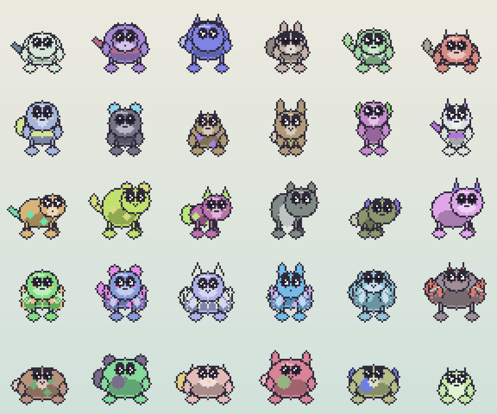
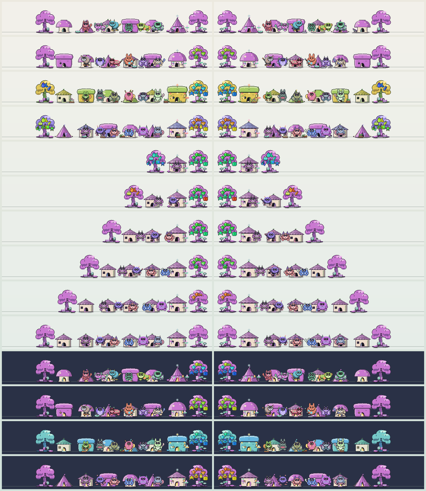
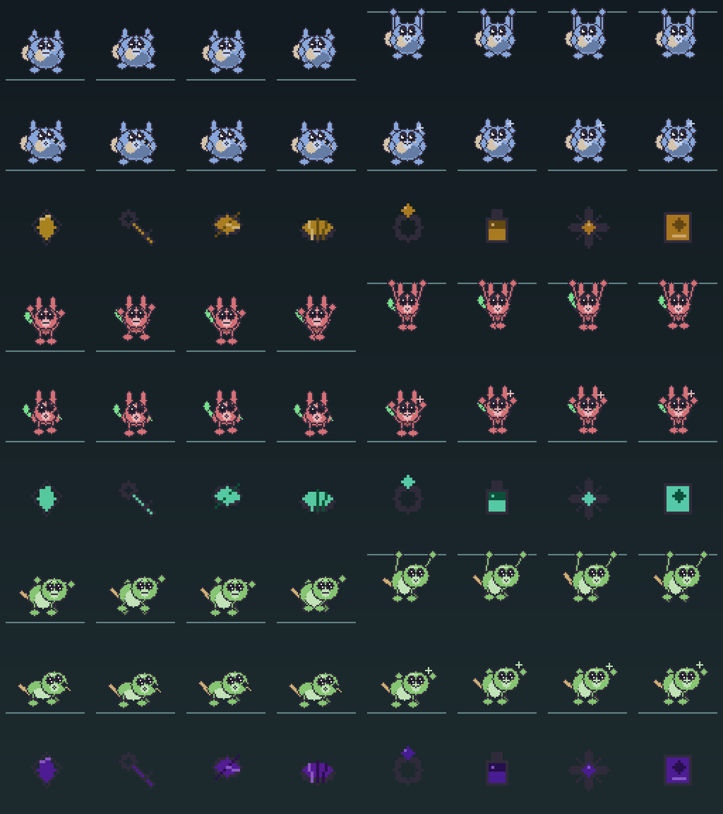
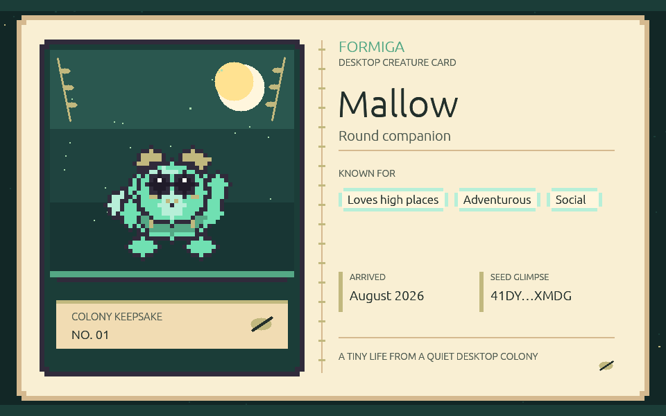

# Formiga · v0.55.6

<p align="center"></p>


Formiga is a privacy-first desktop companion for macOS and Windows. Seeded procedural creatures
live in transparent overlays on your desktop, develop small habits, perch on ordinary windows,
react to your cursor, and eventually grow into a four-creature colony with a home of its own.

Everything happens locally. The only optional network feature is a daily check for new releases,
and it can be turned off.

## Download and run

Open the [Releases page](https://github.com/Von-Van/Formiga-Desktop/releases) and pick the file for
your computer. No terminal or development tools are required.

- **macOS 14+** — download the `.dmg`, open it, and drag Formiga to Applications.
- **Windows 10/11** — download the `.msi` and run it. It adds normal Desktop and Start-menu
  shortcuts.

Downloads are named after their release, for example `Formiga-0.55.6-macOS-universal.dmg`. Each one
ships with a matching `.sha256` file, so keep the original filename if you want to verify it.

These builds are not code-signed yet, so the first launch needs one extra step: on macOS,
Control-click the app and choose **Open**; on Windows, choose **More info → Run anyway**. Formiga
will never ask you to turn off any operating-system security feature.

Settings open automatically the first time you launch. After that, the menu-bar or tray icon offers
Show/Hide, Pause, Gather Creatures, Check for Updates, Settings, and Quit.


## New in 0.55.6

Winged creatures grow real wings instead of large accent nubs. Every wing has a lit leading edge, a
shaded underside, and a tip carried up past the shoulder, and each creature grows one of three
structures over that: feathered quills, ribs reaching a drawn-down tip, or a pale panel behind a
darker rim. Which one a creature has comes from its own recipe, so it never changes and travels
with a shared seed code.

## New in 0.55.5

The blob returns as a body plan of its own. Alongside the round, upright, four-pawed, and winged
plans, a blob is a single soft mass that carries its face directly, with stubby feet and no separate
head. It mixes with the same ears, tails, markings, and colors as every other plan.



The colony corner is now a small village. The colony house keeps its own spot, and every companion
after the first gets a house of its own beside it — a full-size cottage for an adult, a matching
half-size one for a mini, all in the house's own style and palette. Loose objects have left their
cubbies and rest directly on the same ground line, tucked between the houses.



Decorations the home earns over time now attach to the shelter they belong to: banners hang from the
actual roofline, lamps mount on the wall, ornaments sit on the real peak, and stones and flowers rest
on the ground. Only the ground pieces still drift, and only by a pixel.


Toys, snacks, cups, and found trinkets are colored against the creature holding them instead of from
its coat, so a belonging reads as a separate thing rather than another marking.

## What creatures do

Formiga does not choose from premade pets. A 256-bit seed resolves a body plan, ears, tail,
proportions, markings, palette, face grammar, personality, and independent random streams, all
rasterized into deterministic 48×48 sprite atlases when the creature loads.


- Read a creature's state through eleven expressions, two-dimensional gaze, eyelids, and irregular
  blinks.
- Watch creatures approach and climb to higher ledges, hop down to lower ones, patrol window tops,
  ride moving windows, and startle when something shifts nearby.
- See them traverse short stacks of overlapping windows and squeeze through safe narrow gaps, with
  routes disappearing the moment the desktop changes.
- Catch quiet moments: snacks, drinks, generated toys, ledge dangling, inspections, and eight
  discovery trinkets held up for a look.
- Click a creature to pet it. Drag it to move it — a quick release tosses it with a soft bounce, a
  slow one places it precisely.
- Let bonded creatures follow, greet, sleep together, share or steal a toy, watch each other climb,
  react to a toss, and occasionally squabble.
- Every so often the colony coordinates a picnic, nap, race, catch game, shelter gathering,
  presentation, hatch day, quiet huddle, or late-night sleep pile.


Creatures remember how they are treated. Pets, tosses, sleep, ledges, window rides, discoveries,
play, home visits, and repeated placement gradually shape bounded behavior scores while the
personality they were generated with stays recognizable. The Colony tab shows those memories, up to
three learned descriptors, age, favorite places, and closest companions; the name is the only thing
you can edit.



## Making creatures your own

In **Settings → Colony → Creature studio** you can preview a fresh creature, or choose
**Create from PNG or JPEG…** for a cute reinterpretation of a picture you have. Dominant colors,
contrasting accents, proportions, and appendage cues steer the result. It is an interpretation, not
object recognition — clear subjects on plain or transparent backgrounds work best. Try another
preview for a different take, then add it or replace a creature you have not kept.

There is no AI model, cloud service, or background image processing behind this. The picture is read
once, in memory, to pick parts from Formiga's own bounded set; the pixels, path, and everything
measured from them are discarded as soon as the preview is drawn.

Any creature can be copied as a checksummed `FORMIGA-…` seed code. Importing one recreates its
appearance and personality entirely offline and starts it with a fresh life and history. Names,
memories, relationships, and anything about your desktop are never part of the code.

Each Colony profile can also export a 960×600 illustrated creature card using the creature's real
sprite and palette, with its family, learned descriptors, arrival month, and only a short glimpse of
its seed.



## Settings you may want

- Limit where creatures go with presets, or up to 32 allowed and excluded rectangles across displays.
- Let chosen applications visually cover creatures, without Formiga ever inspecting window contents.
- Reduce motion, pause the colony, or hide it entirely.
- Turn the daily release check off under **Settings → About**.

Formiga never installs an update on its own. When one is available it verifies the download's
SHA-256 and hands the installer to your operating system to run.

## Privacy

The colony, its behavior, and its history stay on your computer. Formiga uses window rectangles and
motion only — never window contents, never screen capture. The optional release check makes at most
one request per day and sends nothing about you or your colony.

See the [privacy model](docs/PRIVACY.md) for specifics.

## Workspace

- `formiga-core` — deterministic simulation, behavior, habitats, colony timing, save migration.
- `formiga-art` — genomes, procedural rasterization, rigs, poses, and animation atlases.
- `formiga-desktop` — overlays, interaction proxies, settings, tray, GPU rendering, OS adapters.
- `formiga-tools` — review sheets, animation diagnostics, demo assets, accelerated-time simulation.

## Development

Rust 1.97.1 is pinned.

```sh
cargo fmt --all --check
cargo clippy --workspace --all-targets -- -D warnings
cargo test --workspace
cargo run -p formiga-desktop
```

Regenerate the documentation images with:

```sh
cargo run -p formiga-tools -- hero-image
cargo run -p formiga-tools -- demo-animation
cargo run -p formiga-tools -- contact-sheet --output docs/assets/contact-sheet.png
cargo run -p formiga-tools -- generation-sheet --output docs/assets/generation-sheet.png
cargo run -p formiga-tools -- animation-preview --seed 17 --output docs/assets/animation-preview.png
cargo run -p formiga-tools -- expression-sheet --output docs/assets/expression-sheet.png
cargo run -p formiga-tools -- gesture-sheet --output docs/assets/gesture-sheet.png
cargo run -p formiga-tools -- activity-sheet --output docs/assets/activity-sheet.png
cargo run -p formiga-tools -- ambient-sheet --output docs/assets/ambient-sheet.png
cargo run -p formiga-tools -- shelter-sheet --output docs/assets/shelter-sheet.png
cargo run -p formiga-tools -- home-yard-sheet --output docs/assets/home-yard-sheet.png
cargo run -p formiga-tools -- creature-card --output docs/assets/creature-card.png
cargo run -p formiga-tools -- app-icon --output packaging/shared
```

macOS 14+ and Windows 10/11 x64 are the supported targets, and CI builds both. Releases are
unsigned previews until Developer ID and Authenticode credentials are in place.

Further reading: [creature generation](docs/GENERATION.md), [case study](docs/CASE_STUDY.md),
[architecture](docs/ARCHITECTURE.md), [build guide](docs/BUILD.md),
[privacy model](docs/PRIVACY.md), and [test matrix](docs/TEST_MATRIX.md).
