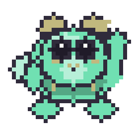
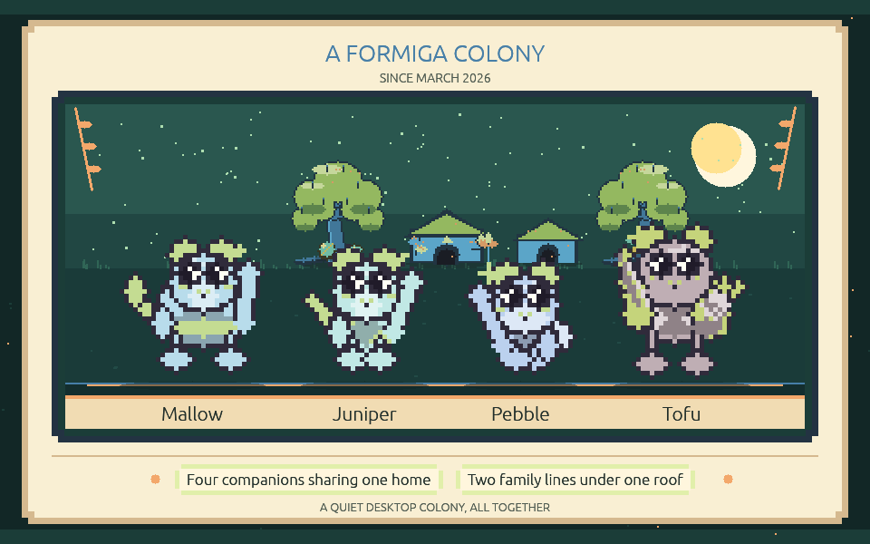

# Formiga · v0.58.9

<p align="center"></p>


Formiga is a privacy-first desktop companion for macOS and Windows. Seeded procedural creatures
live in transparent overlays on your desktop, develop small habits, perch on ordinary windows,
react to your cursor, and eventually grow into a six-creature colony with a home of its own.

Everything happens locally. The only optional network feature is a daily check for new releases,
and it can be turned off.

I'd also like to note that various AI models have been used in the development of this project, including both GTP-6 Astra and Claude Opus 5. 

## Download and run

Open the [Releases page](https://github.com/Von-Van/Formiga-Desktop/releases) and pick the file for
your computer. No terminal or development tools are required.

- **macOS 14+** — download the `.dmg`, open it, and drag Formiga to Applications.
- **Windows 10/11** — download the `.msi` and run it. It adds normal Desktop and Start-menu
  shortcuts.

Downloads are named after their release, for example `Formiga-0.58.9-macOS-universal.dmg`. Each one
ships with a matching `.sha256` file, so keep the original filename if you want to verify it.

These builds are not code-signed yet, so the first launch needs one extra step: on macOS,
Control-click the app and choose **Open**; on Windows, choose **More info → Run anyway**. Formiga
will never ask you to turn off any operating-system security feature.

Settings open automatically the first time you launch. After that, the menu-bar or tray icon offers
Show/Hide, Pause, Gather Creatures, Check for Updates, Settings, and Quit.


## New in 0.58.9

A colony that has filled up no longer leaves anybody standing on somebody else's face. Six
companions share the floor four used to, and the bookkeeping that watches for one of them being
drawn through another only had room for a colony of four — so once the sixth arrived it started
crediting one pair's time to a different pair entirely, and nobody was ever asked to step aside
from an overlap that was genuinely happening. The worst case measured twenty-two seconds of one
face behind another body. It is a little over two now, and across sixteen seeded sessions the
worst anywhere fell from 22.2 seconds to 8.2.

Two smaller things came out of the same work. A companion asked to step aside is now given the
time to actually do it before anybody checks again, instead of being assumed to have succeeded the
moment it was asked — which is what let a pair sit drawn through each other through a five-second
cooldown. And a companion walking over to a friend now keeps clear of whoever else is standing
about on the way, rather than aiming at a spot measured against its friend alone and landing on a
third.

## New in 0.58.8

Choosing where your companions live no longer leaves the desktop unusable. Opening the desktop
region editor used to freeze the colony on its last frame and draw none of the regions you dragged
out, and the first press on the desktop put a full-screen window in front of the settings panel —
so Apply and Cancel were both behind something that swallowed every click, and the only thing left
that answered the mouse was the tray icon. The editor now draws what you are drawing, and the
settings panel stays on top of it. Using the editor also used to cost you the creature menus for
the rest of the session: right-clicking a companion, petting one, and picking one up all stopped
working until Formiga was restarted. They come back now.

The village has also moved up off the Dock. The colony used to be founded forty points above the
bottom of the screen, which is inside a Dock at its factory size, so the houses spent their lives
behind it. They stand just clear of it now — and clear of the Windows taskbar, which gets the same
treatment.

## New in 0.58.7

A colony can grow to six now. Every full-size companion gets a house of its own, and the little
ones live with their big versions rather than in cottages of their own — so the corner is a row of
real houses rather than a row of doorsteps. It also takes up less of your desktop than the
four-companion village did, because the standing places between the houses are gone.

They are not standing places any more because the whole strip of ground between the two trees
belongs to the colony. A companion at home wanders it: somewhere to stand, a while there, then
somewhere else, keeping out of everybody's way and mostly out of the doorways. Hand it a snack
while it is walking and it stops where it is and takes it.

## New in 0.58.5

The colony corner has trees now — one at each end, with the houses gathered between them, so it
reads as one small place rather than a row of buildings. Every keepsake your creatures have found
hangs in the branches on a cord of its own: the everyday finds in the tree beside the colony
house, the ones that only turn up in a particular circumstance in the tree at the far end. Each
keepsake keeps its spot for good, so a tree fills in over the months exactly as the scrapbook
does. The colony's belongings have moved out of the lane between the houses and lie scattered
around the two trunks instead, a few behind each tree and a few out in front of its roots.

A visitor arriving at the houses walks the village now instead of standing at one end of it. It
goes from place to place, stopping a few times, and at each stop it goes over to whichever
companion it has not met yet — so a visit means meeting everybody rather than keeping one
creature company. Companions near one another have also stopped shivering on the spot: a walk
now stops when it arrives somewhere rather than stepping over the spot and back.

For all that, the village takes up less of your desktop than it did — about 15% narrower, with
two trees in it that were not there before. Formiga also does less work to keep the colony
going: on a busy desktop with the cursor moving it costs roughly a quarter less than it used to,
and a colony at home about three fifths less, with not a single creature behaving differently.

Nothing about your colony needs doing. The save file is unchanged, so 0.58.5 opens what 0.58.0
wrote and the trees simply appear, drawn from the seed and the scrapbook your colony already has.

## New in 0.58.0

Right-click a creature — Control-click on macOS — and a small strip floats above its head: hold out
a snack, hold out a toy, send the whole colony home, or open that creature's profile. Whether the
snack or the toy is taken is up to the creature. A hungry one eats, a bored one plays, a sleepy one
shows you it would rather not, and a timid one takes a moment to think it over. Creatures answer
what you do with a small picture above the head rather than with words: a heart for a pet, a dizzy
swirl after a toss lands, a house when they are on their way home. They have also stopped standing on
top of one another — a face hidden behind somebody else's body is cleared within a moment, though
friends still rest shoulder to shoulder, because that is how creatures rest.



Someone new turns up at about one home gathering in four: a creature from nowhere in particular who
walks in along the floor, says hello, spends the gathering pottering about with your colony, and
leaves before the houses close. You can also paste a friend's seed code to invite their creature for
a day, and if your colony has room you can ask a visitor to stay for good. The Journal page keeps a
guest book of the last two dozen who came by, each with a code to copy. The corner they visit has
grown, too: bigger cottages, every creature resting beside its own front door, and small doorstep
moments while the colony is home — a nibble, a nap, a wave the neighbour waves back at, a short
errand out to a belonging and back.

There are sixteen kinds of trinket to find now. Eight turn up on any ordinary day; the other eight
only ever turn up in a particular circumstance — after dark, high on a ledge, in the middle of a
window ride, or standing beside a close friend — and the scrapbook shows the ones nobody has found
yet as a dim silhouette with a hint. Any creature can be saved as an animated sticker, and the whole
colony as a portrait.



## New in 0.57.1

Your creatures now hold themselves the way the moment calls for. A watcher covers its eyes when the
jump looks bad, gasps at a near miss, and throws its arms up when it goes well. A jumper squares up
at the edge and wobbles when it just makes it. Tug of war is a real contest of shoulders, the
hide-and-seek seeker covers its eyes while counting, and the loser of a staring match hides its
face while the winners celebrate. Wings and paws also behave: whichever limb a creature has is the
one that reaches, instead of a second arm appearing beside it.

## New in 0.57.0

Your creatures notice the desktop, and each other. When a window moves, a companion riding it grips
on or enjoys the ride, and whoever is nearby turns to watch: a gasp at a close call, covered eyes
from a timid onlooker, delight when a landing goes well. A long jump brings a look down, a step
back, and sometimes a change of heart. Ordinary moments grow into small games — a chase, leapfrog,
tag, a race across your windows, the floor is lava, hide and seek, and more — and any creature can
decline to play.

The journal groups moments by day, filters to one companion, and keeps up to eight you want to hold
on to. A scrapbook remembers the first time each kind of trinket was found, and the home page shows
your actual village. Settings add a charcoal theme, larger text, an optional outline for busy
wallpaper, and a weekly routine that switches between your Work and Relax presets. Formiga also uses
a small fraction of the CPU it used to, and less memory.

## New in 0.55.6

Winged creatures grow real wings instead of large accent nubs. Every wing has a lit leading edge, a
shaded underside, and a tip carried up past the shoulder, and each creature grows one of three
structures over that: feathered quills, ribs reaching a drawn-down tip, or a pale panel behind a
darker rim. Which one a creature has comes from its own recipe, so it never changes and travels
with a shared seed code.

## New in 0.55.5

The blob returns as a body plan of its own. Alongside the round, upright, four-pawed, and winged
plans, a blob is a single soft mass that carries its face directly, with stubby feet and no separate
head. It mixes with the same ears, tails, markings, and colors as every other plan.


The colony corner is now a small village. The colony house keeps its own spot, and every companion
after the first gets a house of its own beside it — a full-size cottage for an adult, a matching
half-size one for a mini, all in the house's own style and palette. Loose objects have left their
cubbies and rest directly on the same ground line, tucked between the houses.


Decorations the home earns over time now attach to the shelter they belong to: banners hang from the
actual roofline, lamps mount on the wall, ornaments sit on the real peak, and stones and flowers rest
on the ground. Only the ground pieces still drift, and only by a pixel.


Toys, snacks, cups, and found trinkets are colored against the creature holding them instead of from
its coat, so a belonging reads as a separate thing rather than another marking.

## What creatures do

Formiga does not choose from premade pets. A 256-bit seed resolves a body plan, ears, tail,
proportions, markings, palette, face grammar, personality, and independent random streams, all
rasterized into deterministic 48×48 sprite atlases when the creature loads.


- Read a creature's state through eleven expressions, two-dimensional gaze, eyelids, and irregular
  blinks.
- Watch creatures approach and climb to higher ledges, hop down to lower ones, patrol window tops,
  ride moving windows, and startle when something shifts nearby.
- See them traverse short stacks of overlapping windows and squeeze through safe narrow gaps, with
  routes disappearing the moment the desktop changes.
- Catch quiet moments: snacks, drinks, generated toys, ledge dangling, inspections, and sixteen
  discovery trinkets held up for a look.
- Click a creature to pet it. Drag it to move it — a quick release tosses it with a soft bounce, a
  slow one places it precisely.
- Right-click one (Control-click on macOS) for a small strip above its head: a snack, a toy, send
  the colony home, or its profile. What a creature does about the snack or the toy is its own
  decision, and it answers with a picture over its head — a heart, a snack, a question mark, or a
  gentle no.
- See a creature stop and genuinely watch something: drawn up tall, head leaned toward the window
  that just moved, ears pricked, waiting to see what happens next.
- Notice that nobody's face stays hidden behind somebody else's body for more than a moment.
  Resting friends still sit shoulder to shoulder; it is being covered up that gets sorted out.
- Watch a stranger come by while the colony is home — a creature nobody knows, who walks in, says
  hello, spends the gathering with everyone, and wanders off again.
- Look in on the houses and find small doorstep moments: a nibble, a drink, a game, a look up at
  its own front door, a nap, a wave to the neighbour, or a short errand out to a belonging.
- Let bonded creatures follow, greet, sleep together, share or steal a toy, watch each other climb,
  react to a toss, and occasionally squabble.
- Watch a creature think twice about a long jump: a look down, a step back, up to two changes of
  mind, and then either the leap or a quiet retreat. A jump that falls short can catch the edge and
  struggle up, and a companion may come over and pull it in.
- Notice that the watchers are watching in their own time. One gasps at a near miss, a timid one
  covers its eyes until it is over, a playful one celebrates a landing, and a creature facing the
  other way is slower to look up.
- Ordinary meetings turn into small games: a chase, a procession, a dance, a pile beside someone
  resting, leapfrog, keep-away, tug-of-war, tag, turns at a gap, a route to copy, a contest for the
  best spot on a ledge, a staring match, or creeping around a companion who is asleep.
- Three of the games are about your desktop itself. Two creatures race across the windows to a ledge
  they can both reach, or play the-floor-is-lava along the ledge tops, or one hides around the far
  end of a surface while the other counts and then goes looking. Any invitation can be turned down.
- Spot two riders on the same moving window watching each other and showing off once the ride
  settles, or a playful creature dashing alongside a fast cursor for a moment without leaving its
  own display.
- Every so often the colony coordinates a picnic, nap, race, catch game, shelter gathering,
  presentation, hatch day, quiet huddle, or late-night sleep pile.


Creatures remember how they are treated. Pets, tosses, sleep, ledges, window rides, discoveries,
play, home visits, and repeated placement gradually shape bounded behavior scores while the
personality they were generated with stays recognizable. The Colony tab shows those memories, up to
three learned descriptors, age, favorite places, and closest companions; the name is the only thing
you can edit.

A journal keeps small moments — arrivals, discoveries, a preference a creature has settled into, a
new close friendship, a completed ritual, a keepsake that turned up, a decoration the home earned —
grouped by Today, Yesterday, and the date, in your own local time. You can filter it to one
companion, and keep up to eight moments pinned above the rest. A pin points at a moment the journal
already holds, so it can never say something that did not happen. Alongside it, a
scrapbook records the first time each of the sixteen kinds of trinket was found, with a drawing of
it, the date, and who found it — still named even if that companion has since left. Eight of those
kinds turn up on any ordinary day; the other eight only in a particular circumstance, and until one
has been found its slot shows a dim silhouette and a hint about where to look. Every find hangs in
the village too, in its own place in one of the two trees. The Journal page also
keeps a guest book: the last two dozen creatures who came by the houses, when each one visited, and
a code that recreates it. The Home page shows
the corner as it really is: the colony house with the decorations it has earned, a cottage for each
companion, a keepsake tree at either end with everything the colony has found hanging in it, and
the belongings scattered in the two yards. Looking at it never calls anyone home.


## Making creatures your own

In **Settings → Colony → Creature studio** you can preview a fresh creature, or choose
**Create from PNG or JPEG…** for a cute reinterpretation of a picture you have. Dominant colors,
contrasting accents, proportions, and appendage cues steer the result. It is an interpretation, not
object recognition — clear subjects on plain or transparent backgrounds work best. Try another
preview for a different take, then add it or replace a creature you have not kept.

There is no AI model, cloud service, or background image processing behind this. The picture is read
once, in memory, to pick parts from Formiga's own bounded set; the pixels, path, and everything
measured from them are discarded as soon as the preview is drawn.

Any creature can be copied as a checksummed `FORMIGA-…` seed code. Importing one recreates its
appearance and personality entirely offline and starts it with a fresh life and history. Names,
memories, relationships, and anything about your desktop are never part of the code.

A code can also be an invitation. Paste one under **Settings → Creature studio → Adopt a shared
companion from a code** and the preview offers **Invite for a day** beside adopting: the friend's
creature comes to your houses at every gathering for the next twenty-four hours, can be petted and
offered things like anyone else, and goes home when the day is up. Nobody joins your colony, and
nothing about theirs is read. If your colony has room you can still ask a visitor to stay, and it
begins a fresh life of its own exactly as an adopted creature does. A guest's code carries the same
appearance and temperament as any shared code, and nothing more.

Each Colony profile can also export a 960×600 illustrated creature card using the creature's real
sprite and palette, with its family, learned descriptors, arrival month, and only a short glimpse of
its seed.


A profile can export an animated sticker as well: a walk, a wave, a cheer, playing, a snack, a nap,
or a dance, at four or eight times size, as an ordinary looping GIF timed to that creature's own
cadence. And the Home page can export a colony portrait of everyone at once, with their names, the
month the colony began, and your village behind them. All three are ordinary image files; the save
dialog opens before anything is drawn, and cancelling makes nothing.

## Settings you may want

- Limit where creatures go with presets, or up to 32 allowed and excluded rectangles across displays.
- Let chosen applications visually cover creatures, without Formiga ever inspecting window contents.
- Reduce motion, pause the colony, or hide it entirely.
- Choose a light or dark window, or follow your system, and raise the text size up to 150%. This
  changes the settings window only; creatures look the same either way.
- Turn on a soft outline behind creatures if your wallpaper is bright or busy. It is drawn from the
  creature's own shape, reads nothing from your screen, and does not change where you can click.
- Save a Work and a Relax preset, then let a weekly routine move between them at times you pick, up
  to fourteen changes a week. It shows which one is in force and what is next, steps aside if you
  choose one by hand until the next change comes round, and only ever applies the routine meant for
  right now — a machine that slept through a week of changes wakes into today's, not through all of
  them. Showing the colony, pausing it, and a quiet moment stay yours.
- Turn the daily release check off under **Settings → About**.

Formiga never installs an update on its own. When one is available it verifies the download's
SHA-256 and hands the installer to your operating system to run.

## Privacy

The colony, its behavior, and its history stay on your computer. Formiga uses window rectangles and
motion only — never window contents, never screen capture. The optional release check makes at most
one request per day and sends nothing about you or your colony.

See the [privacy model](docs/PRIVACY.md) for specifics.

## Workspace

- `formiga-core` — deterministic simulation, behavior, habitats, colony timing, save migration.
- `formiga-art` — genomes, procedural rasterization, rigs, poses, and animation atlases.
- `formiga-desktop` — overlays, interaction proxies, settings, tray, GPU rendering, OS adapters.
- `formiga-tools` — review sheets, animation diagnostics, demo assets, accelerated-time simulation.

## Development

Rust 1.97.1 is pinned.

```sh
cargo fmt --all --check
cargo clippy --workspace --all-targets -- -D warnings
cargo test --workspace
cargo run -p formiga-desktop
```

Regenerate the documentation images with:

```sh
cargo run -p formiga-tools -- hero-image
cargo run -p formiga-tools -- demo-animation
cargo run -p formiga-tools -- contact-sheet --output docs/assets/contact-sheet.png
cargo run -p formiga-tools -- generation-sheet --output docs/assets/generation-sheet.png
cargo run -p formiga-tools -- animation-preview --seed 17 --output docs/assets/animation-preview.png
cargo run -p formiga-tools -- expression-sheet --output docs/assets/expression-sheet.png
cargo run -p formiga-tools -- gesture-sheet --output docs/assets/gesture-sheet.png
cargo run -p formiga-tools -- activity-sheet --output docs/assets/activity-sheet.png
cargo run -p formiga-tools -- ambient-sheet --output docs/assets/ambient-sheet.png
cargo run -p formiga-tools -- shelter-sheet --output docs/assets/shelter-sheet.png
cargo run -p formiga-tools -- home-yard-sheet --output docs/assets/home-yard-sheet.png
cargo run -p formiga-tools -- prop-sheet --output docs/assets/prop-sheet.png
cargo run -p formiga-tools -- ui-sheet --output docs/assets/ui-sheet.png
cargo run -p formiga-tools -- creature-card --output docs/assets/creature-card.png
cargo run -p formiga-tools -- colony-card --output docs/assets/colony-card.png
cargo run -p formiga-tools -- sticker --clip wave --scale 8 --output docs/assets/sticker-wave.gif
cargo run -p formiga-tools -- social-preview --output docs/assets/social-preview.png
cargo run -p formiga-tools -- itch-cover --output packaging/itch/cover.png
cargo run -p formiga-tools -- app-icon --output packaging/shared
```

`sticker` also takes `--seed NUMBER`; every one of these subcommands writes to the path shown above
when `--output` is omitted.

macOS 14+ and Windows 10/11 x64 are the supported targets, and CI builds both. Releases are
unsigned previews until Developer ID and Authenticode credentials are in place.

Further reading: [creature generation](docs/GENERATION.md), [case study](docs/CASE_STUDY.md),
[architecture](docs/ARCHITECTURE.md), [build guide](docs/BUILD.md),
[privacy model](docs/PRIVACY.md), and [test matrix](docs/TEST_MATRIX.md).


