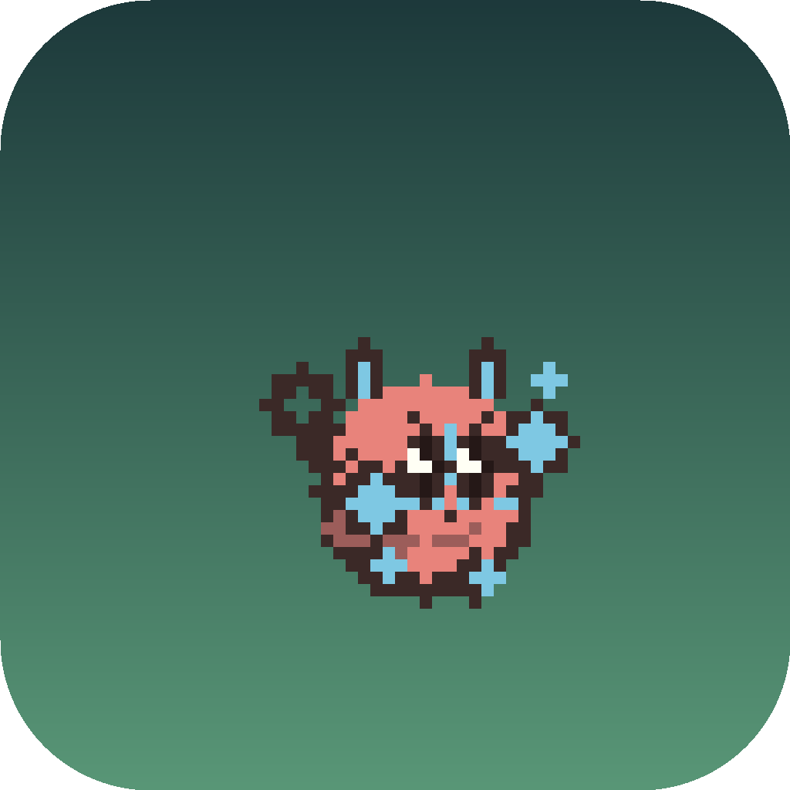
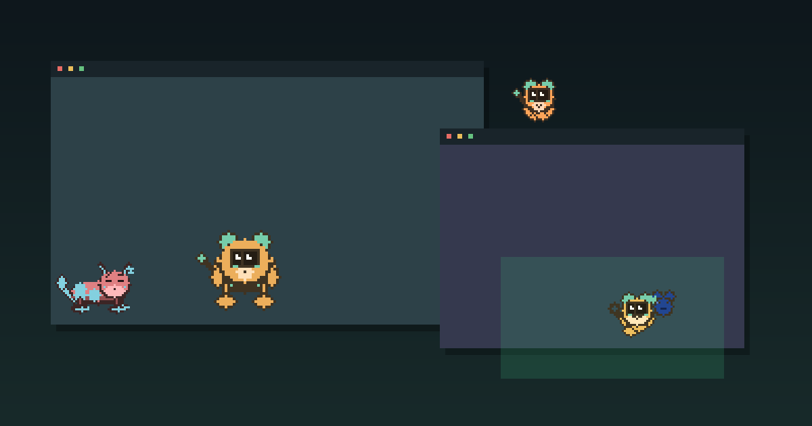
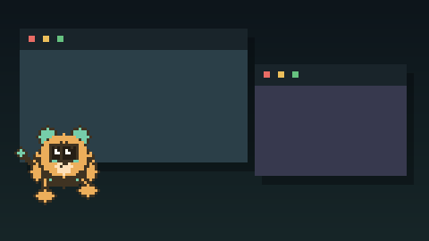
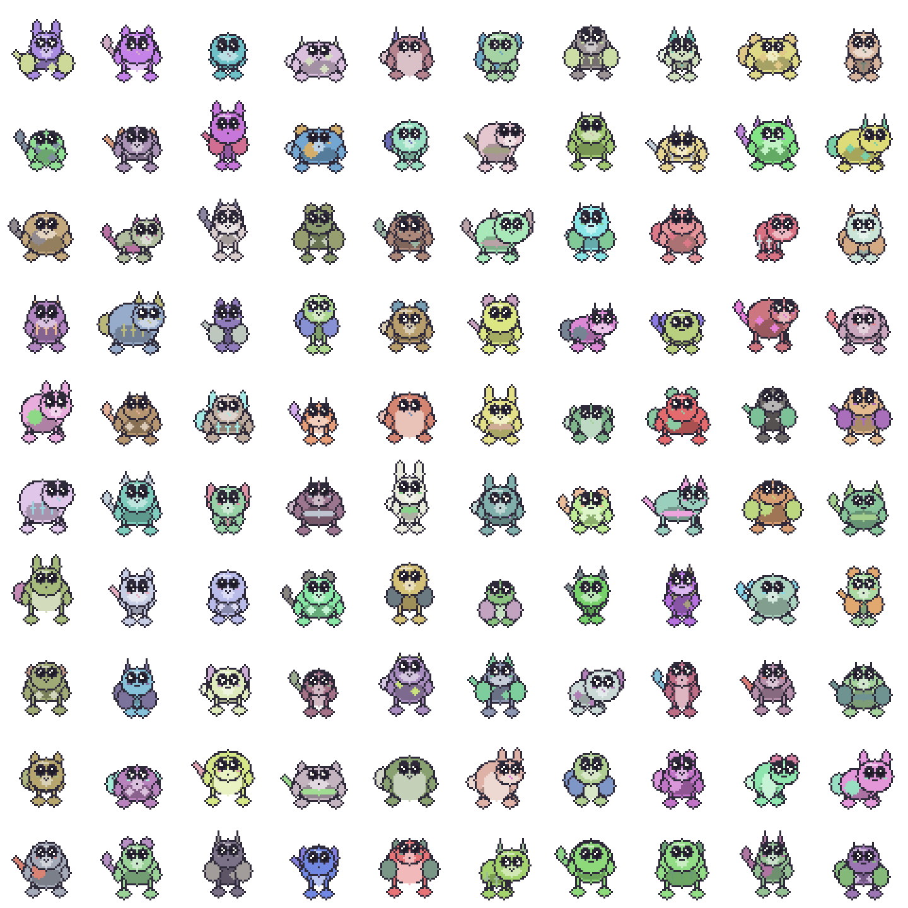
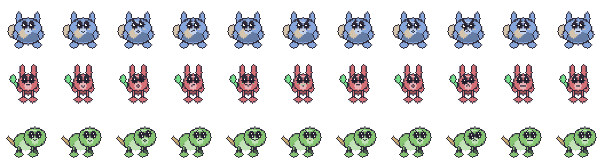
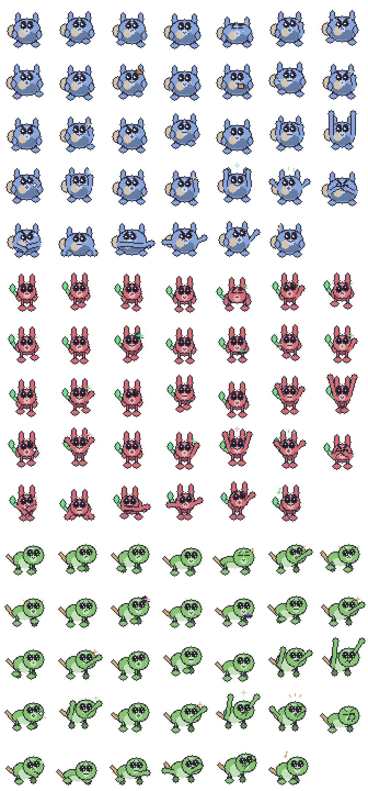
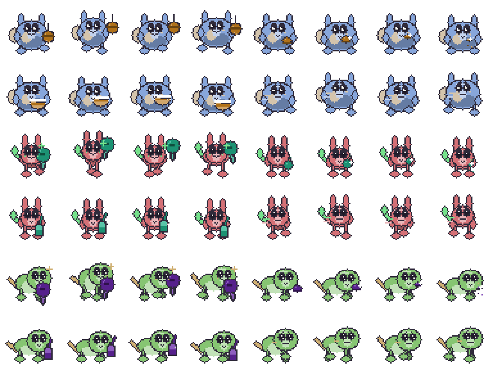
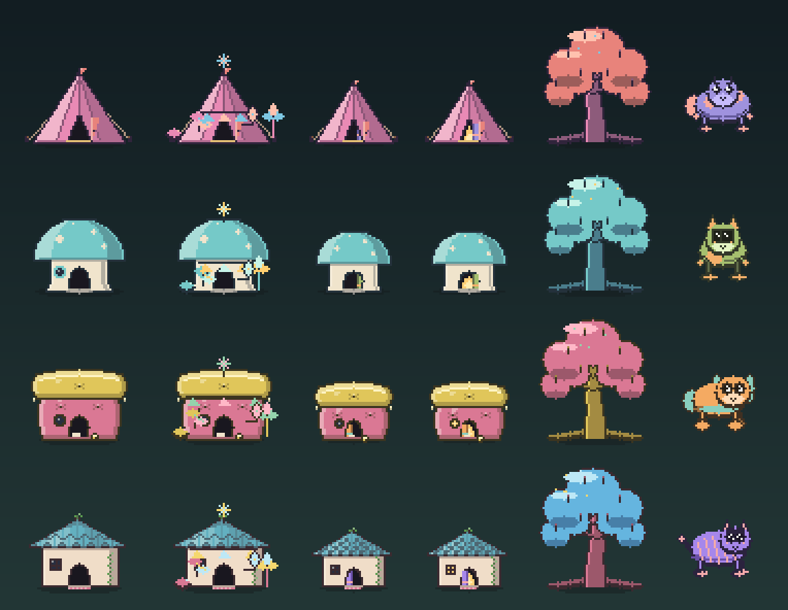

# Formiga

<p align="center"></p>



Formiga is a privacy-first desktop ecosystem for macOS and Windows. Seeded procedural creatures live
in transparent desktop overlays, develop simple habits, perch on ordinary windows, react to the
cursor, and eventually grow into a four-creature colony. The colony and its behavior stay local;
the only optional network feature is a lightweight GitHub release check.

Between those larger reactions, creatures now entertain themselves with generated toys, pause for
small snacks and drinks, and occasionally sprint along their current desktop surface.

## Download and run

Open the [Releases page](https://github.com/Von-Van/Formiga-Desktop/releases) and choose the file
for your computer—no terminal or development tools are required:

- **macOS 14+:** download `Formiga-0.37.1-macOS-universal.dmg`, open it, and drag Formiga to
  Applications.
- **Windows 10/11:** download `Formiga-0.37.1-windows-x64.msi` and follow the installer. It adds
  normal Desktop and Start-menu shortcuts.

Every release names its downloads after its own version, so a later release publishes the same two
names with its version in place of `0.37.1`. The assisted updater matches those exact names, so do
not rename a downloaded installer if you intend to verify it against its `.sha256` companion.

Settings opens automatically on first launch. After that, the Formiga menu-bar/tray icon provides
Show/Hide, Pause, Gather Creatures, Check for Updates, Settings, and Quit. Formiga can check the
public GitHub Releases page once per day, and the option can be disabled under **Settings → About**.
It never silently installs an update: Windows opens a verified MSI, while macOS opens a verified DMG
so the user can replace the app. The current portfolio downloads are unsigned, so macOS may require
Control-click → **Open**, while Windows may require **More info → Run anyway**. Those warnings
disappear once release signing credentials are added; Formiga never asks users to disable
operating-system security.



The v0.31 background-efficiency release keeps the expressive emotional and physical performance while
reducing idle desktop work. Full-screen applications cover Formiga by default, active movement is
presented only as quickly as the simulation can produce distinct positions, and resting or hidden
monitor overlays stop redrawing when nothing has changed.

The expressive-art system adds a readable emotional and physical performance to the existing
desktop interactions:

- Read state and activity through eleven expressions, two-dimensional gaze, eyelids, and irregular blinks.
- See family-specific pseudopods, mitten hands, or front paws gesture in every activity.
- Notice tiny pre-baked sleep, investigation, play, greeting, and startle effects without a particle loop.
- Watch generated balls, yarn, leaves, snacks, cups, and bowls coordinate with each family's hands
  or front paws during passive activities.
- See energetic personalities break into short, higher-cost sprints without adding another runtime loop.
- Drag a creature by its opaque pixels without blocking unrelated desktop clicks.
- Limit the colony to presets or up to 32 allowed/excluded rectangles across displays.
- Let selected applications visually cover creatures without inspecting window content.
- Watch creatures hop to reachable ledges, patrol window tops, and startle when nearby windows move.
- Watch creatures transfer between stacked windows instead of remaining on the desktop floor.
- Discover a deterministic corner home with one of four generated shelter families; a home visit
  lasts 15 minutes and cannot return until its 15-minute cooldown has elapsed.
- Dismiss the shelter immediately by dragging a homebound creature back into the desktop world.
- Configure visibility, motion, ledges, cursor behavior, habitat, and applications in a native UI.
- Check for new GitHub releases without blocking the desktop, verify downloads with SHA-256, and
  hand the approved installer to the operating system.
- Load v0.1 colonies through an identity-preserving save migration.

## What's cool about it?

Formiga does not choose from premade pets. A 256-bit seed resolves a constrained genome, family rig,
palette, markings, face grammar, forelimbs, personality, and independent RNG streams. Normalized
authored poses are evaluated against generated anatomy and rasterized to deterministic 48×48 body
atlases. A compact layered face atlas supplies expressions, nine gaze directions, and three eyelid
states without duplicating the full body texture.

The desktop host uses one click-through GPU overlay per monitor. Tiny native proxy windows expose
only a creature's current alpha mask for dragging. Application hiding is a local GPU occlusion mask
computed from safe window rectangles and stable application identities—not screen capture or true
per-app OS z-order manipulation.

Passive-activity props are derived from the creature's stored markings and face signature. They are
rasterized into the body atlas at load time, so colonies gain visual variety without loading external
assets, running particles, or generating art during ordinary desktop use.

The assisted updater is independent of the simulation and renderer. It makes no more than one
automatic metadata request per 24 hours, does all network and hashing work on a background thread,
accepts only the exact platform package name, and refuses to offer an installer until its SHA-256
digest matches the release metadata or companion checksum file.











## Workspace

- `formiga-core` — deterministic simulation, behavior, habitats, colony timing, save migration.
- `formiga-art` — genomes, procedural rasterization, rigs, poses, and animation atlases.
- `formiga-desktop` — overlays, interaction proxies, settings, tray, GPU rendering, OS adapters.
- `formiga-tools` — contact sheets, animation diagnostics, demo assets, accelerated-time simulation.

## Development

Rust 1.97.1 is pinned.

```sh
cargo fmt --all --check
cargo clippy --workspace --all-targets -- -D warnings
cargo test --workspace
cargo run -p formiga-desktop
```

Regenerate the portfolio assets with:

```sh
cargo run -p formiga-tools -- portfolio-hero
cargo run -p formiga-tools -- portfolio-demo
cargo run -p formiga-tools -- contact-sheet --output docs/assets/contact-sheet.png
cargo run -p formiga-tools -- animation-preview --seed 17 --output docs/assets/animation-preview.png
cargo run -p formiga-tools -- expression-sheet --output docs/assets/expression-sheet.png
cargo run -p formiga-tools -- gesture-sheet --output docs/assets/gesture-sheet.png
cargo run -p formiga-tools -- activity-sheet --output docs/assets/activity-sheet.png
cargo run -p formiga-tools -- app-icon --output packaging/shared
cargo run -p formiga-tools -- shelter-sheet --output docs/assets/shelter-sheet.png
```

## Status

Formiga v0.37 is a portfolio preview, not a signed consumer release. macOS 14+ and Windows 10/11 x64
are the supported targets. CI builds both; downloadable previews are intentionally unsigned until
Developer ID and Authenticode credentials are available.

See the [case study](docs/CASE_STUDY.md), [architecture](docs/ARCHITECTURE.md),
[build guide](docs/BUILD.md), [privacy model](docs/PRIVACY.md), and
[test matrix](docs/TEST_MATRIX.md).
