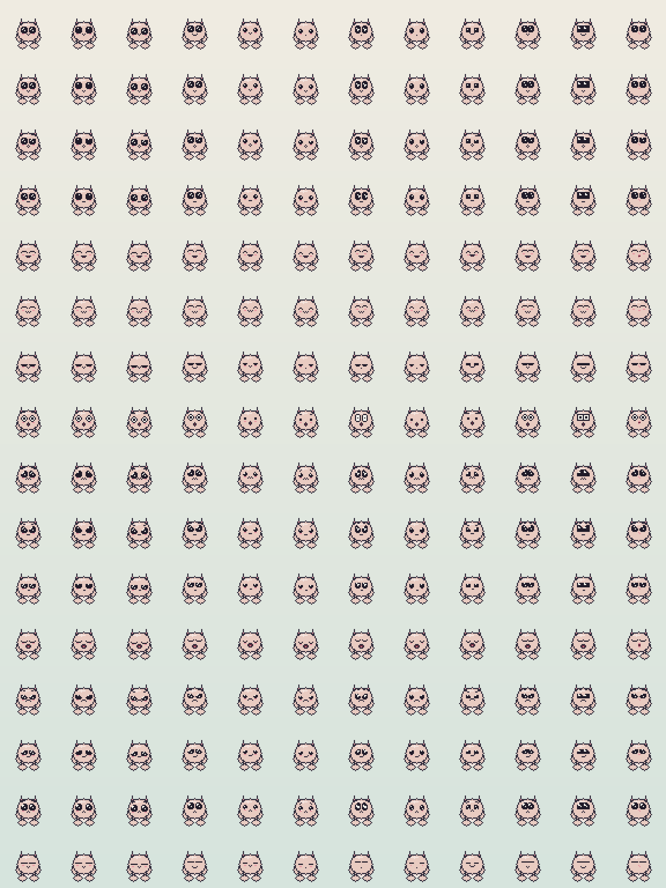
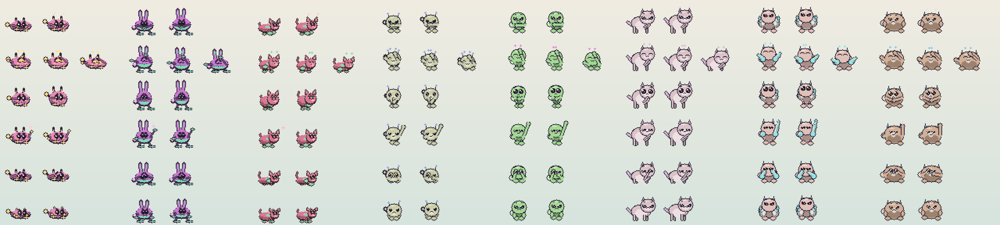

# Modular creature generation · v0.62.2

The design goal is a cute reinterpretation, never image tracing. A photo, illustration, logo,
or unusual reference should resolve to a readable pixel companion with a connected rounded body,
paired limbs, two large expressive eyes, and a mouth. Clear subjects with plain or transparent
backgrounds provide stronger cues. No semantic classifier or model weights are included.

## Small construction recipes

`formiga-core::CreatureDesign` stores sixteen bytes of modular choices and colors, plus six classic
parts that a shared code packs into four more. Five body plans (round, upright, long/four-pawed,
winged, blob) combine independently with six ear styles, five tail choices, bounded body/head/leg
dimensions, three muzzle-patch choices, seven marking treatments, and two RGB colors. All entry
points clamp recipe dimensions; shared-code decoding rejects invalid parts.

The blob plan is a single soft mass: it draws no separate head, carries the face high on the body,
keeps a rounder minimum footprint, and stands on stubby feet. It occupies index 4 so recipes and
version 2 codes written before it decode exactly as they did. A code carrying a blob needs v0.55.5
or newer to import.

The winged plan draws a membrane with a lit leading edge, a shaded underside, and a tip carried past
the shoulder, plus one of three structures: feathered quills, ribs to a drawn-down tip, or a pale
panel behind a darker rim. The structure is a pure function of accent, marking, and tail bytes the
recipe already holds, so wings vary between creatures, never change for a given creature, and travel
inside a version 2 code without another byte. Every mark stays inside the membrane's own outline, so
the silhouette, its connection to the body, and the reserved face are unchanged.

Random creatures use a named stream separate from legacy appearance/personality generation.
Minis inherit the parent's body plan and accent color, usually retain its ear style, and receive
small coat-color variations. Their smaller body proportions retain a large readable face. A
companion with no recipe at all is one of the originals, and its minis are drawn the original way
from its own genes rather than given a recipe unrelated to it.

Image generation analyzes at most 64×64 temporary pixels with aspect ratio preserved. Transparency
or border contrast separates foreground; fixed color bins identify dominant and contrasting colors.
Aspect and appendage cues adapt a fixed 512 candidates, with a quarter left exploratory. The
candidate's rendered color and shape are compared to the summary. The affinity score is not a
confidence that Formiga recognized the subject. Source images, paths, and feature vectors are
discarded; only the accepted parts/proportions/colors become durable state.

## Classic parts

The original one-piece companions had a charm of their own: candy colors with a contrasting accent,
close-set eyes that ran together into a mask or a visor, thin limbs ending in little accent crosses,
antennae, and patterns laid across the whole coat. Six classic parts carry that into the modular
recipe, each chosen independently, so a companion can sit anywhere between the two looks. Every part
at zero is a plain modular recipe, which is how every recipe written before them reads.

| Part | Choices beyond modular |
|---|---|
| Coat | Candy colors: coat and accent at full strength, the fill carried a row up inside its outline so the top edge meets the light, and a crescent of shade instead of a shaded lower half |
| Face | A mask, a visor, beads, tall eyes, or square eyes |
| Limbs | Accent nubs for paws and feet, or stick legs on forked accent feet |
| Crown | Antennae with bobbing accent tips, or sprouts, in place of the ears |
| Pattern | Stripes, spots, or patches of accent across the body, in place of the marking |
| Tail | An open curl, or a star on a stalk |

A new companion first draws how far it leans toward the originals: a quarter lean wholly modular, a
quarter wholly classic, and the half between take each part on its own at a lean of 0.35 or 0.65.
Coat, face, and limbs follow the lean; crown, pattern, and tail are extras that even a wholly classic
companion only sometimes has. Because a mixed lean can still draw no part or all three main ones,
about 29% of new companions come out plainly modular, about a third wear classic colors, face, and
limbs together, and the rest mix the two; each of coat, face, and limbs is classic about half the
time. The parts come from a `classic-parts-v1` stream drawn after the
modular one, so every modular byte a seed produced before classic parts existed is still produced.
A candy coat starts from one of the twelve original palettes' coat and accent pairs, nudged by up to
twelve steps a channel. A mini keeps its parent's coat, face, and limbs, and usually its crown (80%),
pattern (60%), and tail (75%). Image references adapt candidates like any others, so they reach
classic parts too, always in the reference's own colors.

The candy palette is built the way the original hand-made palettes are: a shade that keeps the
coat's hue with most of its saturation dropped, a bright tinted highlight, and an outline and eyes
that are near-black tinted toward the coat. Coat lightness is held between 0.55 and 0.78, so the
eyes stay readable on any reference color. The lit top keeps the silhouette of the outlined oval,
and a folded nub covers the same spot beside the body a modular paw does, so the reserved face, the
one-limb-per-side rule, and the simulation's spacing boxes hold for every part. Stick legs lift the
body without moving the feet, the eye arrangements change only the face layer, and a pattern is
placed from the recipe's own bytes, so it never moves. `classic-sheet` shows each part alone on
every body plan and wholly classic companions through ten poses.

## Archetypes and authored faces

Since 0.62.0 a new companion is made by a second generator, `Edition::Archetypes`, beside the one
every earlier companion came from, `Edition::Original`. A generator goes on drawing exactly what it
always drew from a seed, so a new way of generating is a new edition rather than a change to an old
one: a companion keeps its looks and its temperament, a mini of a family that began before
archetypes is drawn the way its family always was, and a friend's code brings back the same
companion. A recipe says which edition drew it by whether it names an archetype.

An archetype is a set of odds over the parts every recipe already has — body plan, ears and how big,
tail, markings, classic parts and which face — not a species:

| Archetype | What it leans toward |
|---|---|
| Mochi | Round or blob, with tiny limbs and simple ears |
| Critter | Four legs, ears and a tail |
| Bean | Upright, with an oversized head and stubby limbs |
| Puff | Round and fluffy |
| Sprite | Upright, crowned with antennae or sprouts |
| Whelp | Four legs and a tail with some presence to it |
| Birb | Wings, a round body and tiny feet |
| Goober | A blob, and strange on purpose |

Each part is drawn after the ones it has to suit, and its odds lean away from what would clash with
them: big ears make a big tail less likely, wings keep ears and tail simple, a tiny body keeps
everything that sticks out small, a busy outline keeps the markings plain, a bright coat keeps the
accent colour to a few places, and busy markings keep the face plain. Nothing is ruled out; the
odds only lean. Coat and accent start from a harmonious pair — close, opposite, or a third of the
way round the wheel — nudged a little.

`CreatureDesign::drawn` draws the archetype from a `creature-archetype-v1` stream, then how strange
the companion is to be. Seven in ten are the most coherent of six recipes drawn from the
archetype's own odds; two in ten are the most coherent of six that each break one of its rules; and
one in ten is a genuine oddball, the least coherent of six drawn strange on purpose — two or three
rules broken, and four times in ten a goober to start from. `coherence` is a heuristic for choosing
between recipes, from 0 to 1: a head as wide as the body or wider, a plain outline, plain markings,
colours that belong together without vanishing into each other, parts that suit one another, and a
face that fits the head it is on. It is never shown and never judges a companion once it is made.
Over the 150 companions `cuteness-sheet` draws by default, 107 came out cute, 33 weird-cute and 10
oddballs, with mean coherence 0.87, 0.86 and 0.63.

A mini of an archetype companion keeps its parent's archetype, body plan, face and accent, usually
its ears (80%), a coat a few shades off its parent's, and its classic parts the way any mini does,
and draws its own proportions from the archetype's odds.

Every recipe the new generator draws wears one of twelve authored face layouts, numbered from 1 in
`face_template`. A layout fixes the eyes — their shape, size, how far apart, and how high — and how
far below them the mouth sits; the mouth, brows, cheeks and shine still come from the face genes
every companion has, kept to the few each layout allows:

| Layout | Eyes |
|---|---|
| 1 Button | Round, a little apart, over a tiny mouth |
| 2 Wide button | The same, set wide |
| 3 Low and wide | Big and low on the face, the mouth tucked under |
| 4 Modular | The face every modular recipe before 0.62.0 wears |
| 5 Beady | Small and bright, set wide |
| 6 Low beads | The same, low and wide |
| 7 Tall | Tall ovals in the middle of the face |
| 8 Tall and wide | Small tall eyes held apart |
| 9 Square | Small soft squares |
| 10 Mask | The originals' close-set eyes that run together |
| 11 Visor | The originals' squared eyes run into one band |
| 12 Beak | Round eyes over a little beak |

A body busy with stripes, spots or a patch wears its layout with plain cheeks, though a happy face
still blushes. A blob carries its face high on its one mass, so it wears layouts 4 and 12 as 1, 7
as 8 and 11 as 9, a row lower, and wears large eyes no wider set than the button face and rounder.
`face-sheet` shows every layout in every expression.

## Temperament

A companion made by the new generator is given a temperament from a `temperament-v1` stream. It
has nine plain-language axes, each from 0 to 1: solitary to social, calm to energetic, cautious to
bold, serious to playful, incurious to curious, gentle to feisty, patient to impulsive, trusting to
suspicious, and independent to affectionate. Its kind is drawn first — sweetheart, troublemaker,
grump, explorer, wallflower, show-off, scholar, lazybones or guardian at close to even odds, and an
oddball at six in a hundred — and its axes are drawn loosely around that kind's middle, so two
grumps are never the same grump, and now and then one axis ignores the kind altogether. An
oddball has no middle of its own: most of its axes sit out near one end or the other, and it is
rarely patient. If another kind fits the axes a companion was given clearly better, it is read as
that kind. About one in four has a tension, two
things that do not usually go together: brave but nervous, affectionate but independent, playful
but shy, gentle but stubborn, serious but curious, confident but easily embarrassed, lazy but
competitive, suspicious but loyal, dramatic but cowardly, or grumpy but affectionate. The behaviour
values the rest of the simulation reads — sociability, activity, boldness, playfulness and
curiosity — are then taken from the axes, so a grump really does keep to itself.

A profile shows three traits, read out of the axes, the kind and the tension, one from each side of
a companion at most so the three say three different things. There are sixty-eight: warm ones,
plain ones and mild flaws — Grumpy, Nosy, Vain, Stubborn, Jealous, Messy — never more than two
flaws at once, and a trait never sits beside one it contradicts. A phrase in plain English goes with them, such as "A curious
professor" or "A brave little adventurer". Over two thousand new companions each kind is 6 to 12
in a hundred, the commonest trait is on about one in seven, about three in ten of the traits shown
are flaws, and about one in four companions has a tension. A test holds each within bounds, so a
change that sent every companion back toward the same few words would fail it.

Every older companion reads its temperament from the values it has always had, and nothing is drawn
for it: its sociability, energy, boldness, playfulness and curiosity are its own, and the four
sides it never had — feistiness, impulsiveness, suspicion and affection — read as middling, which
also leaves its behaviour exactly as it was. `temperament-sheet` shows the six poses a temperament
strikes.

## Rendering and compatibility

The modular renderer lives beside the legacy renderer in `formiga-art`. It uses the same 48×48
body frames, 16×16 face frames, poses, fifteen expressions, and animation atlases. A face drawn
from an authored layout carries most of its expression in the eyes' own shape — a lid lowered flat
for sleepy or bored, a top corner cut on a slant for a scowl or worry, a shut curve for joy and
affection, white round a shrunken pupil for a fright, the eyes left open with their shine moved
ahead for focus — and draws brows, where the face has them, only while they move, a clear row above
the eyes. A layout's smiling mouth smiles even at rest. The creature studio shows a new face first
walking along pleased with itself, eyes open, and then waving. Every other face is drawn as it always was. Tail/ear geometry sits
behind the body; gestures keep the reserved face area covered and never draw over the layered face;
outlines connect paws to bodies, and each side has exactly one limb that a gesture carries out. The palette
resolver softens colors once during atlas construction and guarantees dark facial contrast. There
are ten gesture poses; the tenth, `Watch`, leans the head toward what the creature is looking at and
pricks its ears, so every body plan needs a head that can lean without leaving the frame or
uncovering the reserved face.

An absent recipe selects the legacy rendering path. Old saves never acquire a replacement design
just by loading them. Version 1 seed codes replay legacy creatures unchanged. Version 2 codes carry
the exact recipe alongside the original seed/generation; keep the serialized enum ordering and the
`modular-design-v1` and `classic-parts-v1` generation streams stable. Version 3 codes are version 2
codes whose four reserved bytes hold the classic parts, two to a byte; a recipe without classic
parts is still written as version 2, byte for byte as before, so every version since v0.55.0 keeps
importing it. A version 2 code with anything in those bytes, or a version 3 code with nothing in
them, is rejected, and a code carrying classic parts needs v0.59.0 or newer. Save version 17 adds the
parts to stored recipes and migrates nothing; it moved so an older build refuses a colony whose
classic parts it would otherwise quietly drop. A recipe the archetype generator drew travels as a
version 4 code, whose last reserved byte holds its archetype and face layout, a nibble each; the
companion it brings back has the temperament that generator gives it. Neither older version may
carry an archetype, a version 4 code must, and a version 4 code needs v0.62.0 or newer. Save
version 20 adds temperaments and archetype recipes and migrates nothing, for the same reason. Incompatible recipe changes require a new format,
not reinterpretation of existing codes. Source provenance duplicates the bounded recipe so sharing
does not depend on a reference file or a temporary preview.

## Belongings and keepsakes

What a creature owns is generated from bytes it already carries. `prop_variants(genome)` reads one
signature out of the appearance genome and picks one of eight toys, one of four snacks, and one of
three kinds of drinkware; none of them adds a gene, and a creature's belongings never change. They
are baked into the same action atlas as the body, anchored to the paw or the mouth that is actually
drawn through `modular::prop_hold`, so a toy is held in a real hand rather than at a guessed offset.
`prop-sheet` shows all fifteen against the bodies that carry them.

Trinkets are a colony's, not a creature's. `formiga-core::trinkets` is the catalogue — a hundred
and sixty entries of name, description, hint, and condition, with `TRINKET_VARIANTS = 160` — and
`formiga-art::TrinketAtlasRenderer` bakes it into one 256×320 sheet of sixteen columns, ten rows of
resting drawings and ten of the same with a glint. Its colours come from the colony seed and are
chosen to stay clear of every member's coat, so a found keepsake reads as a separate object however
the colony is coloured and whoever is holding it. A new variant is a new cell, not a new texture per
creature.

What a companion wears is a colony's finds too. Each of the twenty accessories in
`formiga-core::accessories` is made from one variant and drawn in that variant's inks, and any find
can be worn as a pin. `renderer/accessories.rs` draws the piece onto every body frame as the atlas is
baked, from the `Figure` the frame's body reports — the top of the head, the neck, the chest and the
hip — so it adds no gene, no texture, and no quad.

## Extending safely

- Add a bounded part or body plan with an explicit face-safe area and connected limb roots.
- Keep reduced-motion behavior, mirrored rendering, miniature proportions, and gesture poses. A new
  pose moves the limb a side already has; it never draws a second one beside it.
- Update code versioning before changing the byte layout or meaning of a serialized choice, and
  add a generator edition rather than change what an existing one draws from a seed.
- Preserve atlas dimensions, clip counts, and the colony creature limit unless a separate resource
  budget change is intended. Generation must not introduce an idle worker or retain source pixels.
- Run workspace tests and review `generation-sheet`, `classic-sheet`, `contact-sheet`,
  `cuteness-sheet`, `face-sheet`, `temperament-sheet`, and `animation-preview`. Automated coverage
  includes all body/ear/tail combinations and every combination of classic body parts at extreme
  sizes, connected silhouettes, reserved faces, both eyes in every classic arrangement and face
  layout, every face layout on every body at every size, 1,000 generated creatures across every
  action, legacy migration, both generators byte for byte, the spread of temperaments over two
  thousand companions, and exact sharing, including the v0.58.9 code and recipes byte for byte.

The village is independent of creature generation. `formiga-core::habitat` walks one ground line
outward from the colony house, laying out a keepsake tree, the colony house, and a cottage and a
porch for every later member, and closing with a second tree. The first colony member shares the
colony house; each later full-size one gets a cottage of its own, and a mini lives in its big
version's. Belongings are not
lots at all: they are scattered in the two trees' yards, four to each, so one can never land on a
house. Lots outside the house's accessible region stay hidden, and an inactive house hides the
whole village.

`ShelterRenderer::render_village` bakes every house — the colony house and a cottage per later
full-size companion, each hung with its resident's curtain — by day and lit after dark, and the
keepsake tree, into one 560×320 atlas of 80px cells, each drawn into its own cell-sized tile first
so nothing bleeds into a neighbour. The tree shares the house's own style, palette, and baseline,
so it belongs to the same yard. Every dwelling and every tree is one quad sampling that single
texture — the inward tree samples the tree cell with its horizontal UVs swapped — so the village
adds no texture, sampler, or bind group. Style details scale with the house, which leaves an
unmarked colony house byte-identical to the standalone shelter render. `home-yard-sheet` shows all four styles and both
corners through the same layout function the renderer uses.

Each house is one of four kinds — a tent, a mushroom, a pillow house, or a leaf house. The colony
house is the kind its seed chose, and every cottage is the kind its keeper's own seed chooses, so a
village mixes them; the owner can build any house as any kind from the Home page.

A village's colours come from its seed — two of the twelve creature palettes — until its owner
chooses one of six named palettes, each a fixed pairing of two of those twelve. Only those two
indices change: the style, size and every seeded detail stay the colony's own, and a village given
back its own colours is drawn exactly as it was generated. `village-palette-sheet` shows each style
in its own colours and in all six.
