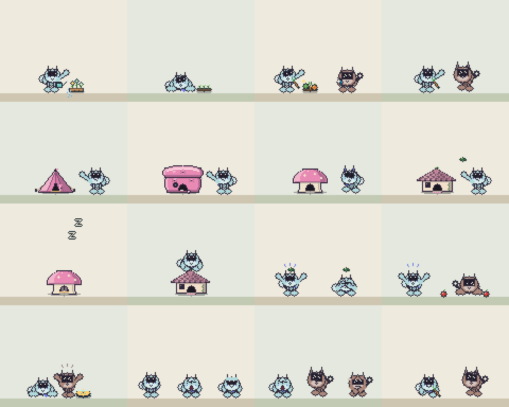
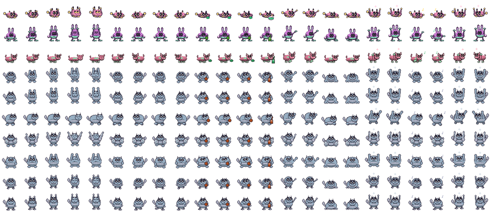
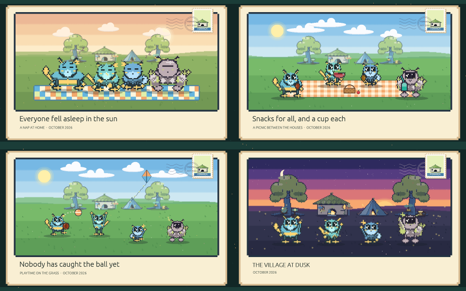

# A guide to Formiga

Everything a colony does, and everything you can do with one. The [README](../README.md) has the
short version; [the release notes](RELEASE_NOTES.md) say when each piece arrived.

## What creatures do

Formiga does not choose from premade pets. A 256-bit seed resolves a body plan, ears, tail,
proportions, markings, palette, face grammar, personality, and independent random streams, all
rasterized into deterministic 48×48 sprite atlases when the creature loads.

- Read a creature's state through twelve expressions, two-dimensional gaze, eyelids, and irregular
  blinks.
- Catch one with nothing to do sitting as if it has something on its mind: it settles, shifts its
  weight onto one foot, tips its head and pricks its ears toward something off to one side, and
  settles back. Each companion leans its own way, and a sleepy one shows a Z as it drops off.
- Watch creatures approach and climb to higher ledges, hop down to lower ones, patrol window tops,
  ride moving windows, and startle when something shifts nearby. A companion that likes to be
  anywhere spends about half of its roaming time up on the windows — any window whose top leaves
  room for it below the menu bar — and comes down now and then to potter about the floor for a
  while before it climbs again.
- See them traverse short stacks of overlapping windows and squeeze through safe narrow gaps, with
  routes disappearing the moment the desktop changes.
- Catch quiet moments: snacks, drinks, generated toys, ledge dangling, inspections, and keepsakes
  held up for a look — a hundred and sixty of them, many only found in the right moment.
- See a yawn go round. One companion yawns, the friend beside it looks over and yawns a moment
  later, and every so often it reaches a third, who holds out for a second before giving in.
- Click a creature to pet it. Drag it to move it — a quick release tosses it with a soft bounce, a
  slow one places it precisely.
- Right-click one (Control-click on macOS) for a small strip above its head: a snack, a toy, send
  the colony home, or its profile. What a creature does about the snack or the toy is its own
  decision, and it answers with a picture over its head — a heart, a snack, a question mark, or a
  gentle no.
- While the houses are out, the same menu offers a moment for the whole village instead of home:
  a second strip opens beside it with a picnic, a dance, or a nap. Everyone home decides for
  themselves; whoever wants to lines up on the ground between the houses and does it together, and
  a dance ends with each dancer celebrating its own way.
- See a creature stop and genuinely watch something: drawn up tall, head leaned toward the window
  that just moved, ears pricked, waiting to see what happens next.
- Notice that nobody's face stays hidden behind somebody else's body for more than a moment.
  Resting friends still sit shoulder to shoulder; it is being covered up that gets sorted out.
- Watch a stranger come by while the colony is home — a creature nobody knows, who walks in, says
  hello, spends the gathering with everyone, and wanders off again.
- Look in on the houses and find small doorstep moments: a nibble, a drink, a game, a look up at
  its own front door, a nap, a wave to the neighbour, or a short errand out to a belonging.
- Watch the village get on with things while the houses are out. Companions water the gardens,
  crouch to look in on something just coming up, pick something ripe and eat it, or carry the best
  of it over to show a friend. They see to their own houses the way each kind asks — retying a
  tent's flap, plumping a pillow fort, patting a mushroom's cap, tidying a leaf house's leaves —
  and the house answers. They go indoors for a while, when the curtain is drawn across the door,
  the window glows and a Z drifts up if they are napping; never more than two at once, and never
  the only companion there is. They climb up and sit on their own roofs, and now and then turn
  something up about the village.
- Catch a small mishap: a leaf landing on somebody's face, a snack rolling away and being chased,
  a companion sitting down just beside the cushion and shuffling across onto it. Each is a start,
  a recovery, and carrying on, and whoever is nearby stops to look.
- Let bonded creatures follow, greet, sleep together, share or steal a toy, watch each other climb,
  react to a toss, and occasionally squabble.
- Watch a creature think twice about a long jump: a look down, a step back, up to two changes of
  mind, and then either the leap or a quiet retreat. A jump that falls short can catch the edge and
  struggle up, and a companion may come over and pull it in.
- Notice that the watchers are watching in their own time. One gasps at a near miss, a timid one
  covers its eyes until it is over, a playful one celebrates a landing, and a creature facing the
  other way is slower to look up.
- Ordinary meetings turn into small games: a chase, a procession, a dance, a pile beside someone
  resting, leapfrog, keep-away, tug-of-war, tag, turns at a gap, a route to copy, a contest for the
  best spot on a ledge, a staring match, or creeping around a companion who is asleep. Each player
  shows a music note as it joins, so a game reads as starting rather than as two creatures
  wandering about.
- Three of the games are about your desktop itself. Two creatures race across the windows to a ledge
  they can both reach, or play the-floor-is-lava along the ledge tops, or one hides around the far
  end of a surface while the other counts and then goes looking. Any invitation can be turned down.
- Spot two riders on the same moving window watching each other and showing off once the ride
  settles, or a playful creature dashing alongside a fast cursor for a moment without leaving its
  own display.
- Every so often the colony coordinates a picnic, nap, race, catch game, shelter gathering,
  presentation, hatch day, quiet huddle, or late-night sleep pile.

Creatures remember how they are treated. Pets, tosses, sleep, ledges, window rides, discoveries,
play, home visits, and repeated placement gradually shape bounded behavior scores while the
personality they were generated with stays recognizable. The Colony tab shows those memories, up to
three learned descriptors, age, favorite places, and closest companions; the name is the only thing
you can edit.

Each companion also has little ways of its own. It celebrates the same way every time — a hop, a
little dance, or a twirl — and over its first days picks up as many as two habits: looking a snack
over before eating it, stretching or turning in circles before a nap, waving hello, or a play bow
before a game. It does them most times the moment comes round, and they appear on its profile and
in the journal on the day it picks them up.

A journal keeps small moments — arrivals, discoveries, a preference a creature has settled into, a
new close friendship, a completed ritual, a keepsake that turned up, something new for the
village — grouped by Today, Yesterday, and the date, in your own local time. You can filter it to
one companion, and keep up to eight moments pinned above the rest. A pin points at a moment the
journal already holds, so it can never say something that did not happen. Beneath it, the
scrapbook lists every keepsake that has been found, newest first, with a drawing of it, the date,
and who found it — still named even if that companion has since left. The Journal page also keeps
a guest book: the last two dozen creatures who came by the houses, when each one visited, and a
code that recreates it.

The Your colony page has the whole Collection: all hundred and sixty keepsakes, the found ones in
colour and the rest as the shadow of their shape with a hint about where they turn up — at night,
at home, in the garden, on a roof, first thing in the morning, at the weekend, under a full moon.
Sixteen of the found ones hang in the village's two trees. The trees fill themselves as finds come
in, or a click hangs one up or takes it down.

What the colony finds, its companions can wear. Each has one place for it: a leaf hat, a flower
crown, an acorn cap, a knitted scarf, a bell collar, a tiny satchel and more, each made from a find
of its own and coloured like it, or any find at all as a pin. Choose it on the companion's profile,
where pointing at something shows the companion wearing it standing, walking, up high and asleep
before it goes on, and Nothing takes it off again.

The Home page shows the corner as it really is: the houses, a keepsake tree at either end with its
keepsakes hanging in it, the belongings scattered in the two yards, and the gardens, spots and
ornaments on the ground between. Looking at it never calls anyone home. Press **Arrange** and it can
be taken hold of: carry a cottage along the row to stand it somewhere else, or anything on the
ground along the ground, and nudge whatever is picked out with the arrow keys. Click a house to see
whose it is and who else lives there, to build it as a tent, a mushroom, a pillow fort or a leaf
house, and to choose what it wears in each of its six places — the roof, under the eaves, a wall
either side of the door, and the ground either side. Beneath it, shelves hold what the village has
to put on its ground: gardens that grow by themselves through sprouts to flowers and fruit, spots
the colony goes to nap, snack or look about at, and ornaments to wander over to. Each kind of thing
starts with three, and something new arrives every day or two.

## Making creatures your own

In **Settings → Colony → Creature studio** you can preview a fresh creature, or choose
**Create from PNG or JPEG…** for a cute reinterpretation of a picture you have. Dominant colors,
contrasting accents, proportions, and appendage cues steer the result. It is an interpretation, not
object recognition — clear subjects on plain or transparent backgrounds work best. Try another
preview for a different take, then add it or replace a creature you have not kept.

Changed your mind? The settings window keeps your last change to the colony — a companion removed,
replaced, started over or welcomed, or the village rearranged — and its footer offers to undo it
for as long as Formiga is running. A companion brought back returns exactly as it left: its name,
memories, friendships, minis, and cottage.

There is no AI model, cloud service, or background image processing behind this. The picture is read
once, in memory, to pick parts from Formiga's own bounded set; the pixels, path, and everything
measured from them are discarded as soon as the preview is drawn.

Any creature can be copied as a checksummed `FORMIGA-…` seed code. Importing one recreates its
appearance and personality entirely offline and starts it with a fresh life and history. Names,
memories, relationships, and anything about your desktop are never part of the code.

A code can also be an invitation. Paste one under **Settings → Creature studio → Adopt a shared
companion from a code** and the preview offers **Invite for a day** beside adopting: the friend's
creature comes to your houses at every gathering for the next twenty-four hours, can be petted and
offered things like anyone else, and goes home when the day is up. Nobody joins your colony, and
nothing about theirs is read. If your colony has room you can still ask a visitor to stay, and it
begins a fresh life of its own exactly as an adopted creature does. A guest's code carries the same
appearance and temperament as any shared code, and nothing more.

Each Colony profile can also export a 960×600 illustrated creature card using the creature's real
sprite and palette, with its family, learned descriptors, arrival month, and only a short glimpse of
its seed.

A profile can export an animated sticker as well: a walk, a wave, a cheer, playing, a snack, a nap,
or a dance, at four or eight times size, as an ordinary looping GIF timed to that creature's own
cadence. And the Home page can export a colony portrait of everyone at once, with their names, the
month the colony began, and your village behind them, or a postcard: everyone napping on a quilt,
picnicking round a blanket, playing on the grass, or waving goodnight in front of the village at
dusk, with a caption of your own if you like. All of them are ordinary image files; the save dialog
opens before anything is drawn, and cancelling makes nothing.

## Settings you may want

- Limit where creatures go with presets, or up to 32 allowed and excluded rectangles across displays.
- Let chosen applications visually cover creatures, without Formiga ever inspecting window contents.
- Reduce motion, pause the colony, or hide it entirely.
- Choose a light or dark window, or follow your system, and raise the text size up to 150%. This
  changes the settings window only; creatures look the same either way.
- Turn on a soft outline behind creatures if your wallpaper is bright or busy. It is drawn from the
  creature's own shape, reads nothing from your screen, and does not change where you can click.
- Save a Work and a Relax preset, then let a weekly routine move between them at times you pick, up
  to fourteen changes a week. It shows which one is in force and what is next, steps aside if you
  choose one by hand until the next change comes round, and only ever applies the routine meant for
  right now — a machine that slept through a week of changes wakes into today's, not through all of
  them. Showing the colony, pausing it, and a quiet moment stay yours.
- Turn the daily release check off under **Settings → About**.

Formiga never installs an update on its own. When one is available it verifies the download's
SHA-256 and hands the installer to your operating system to run. The installer is cleared from
Formiga's data folder the next time Formiga starts on that version or a later one.
