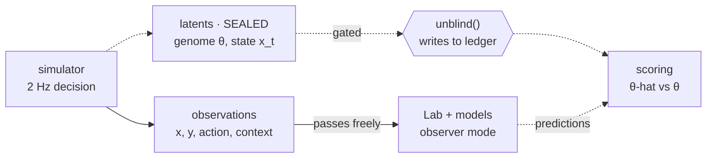
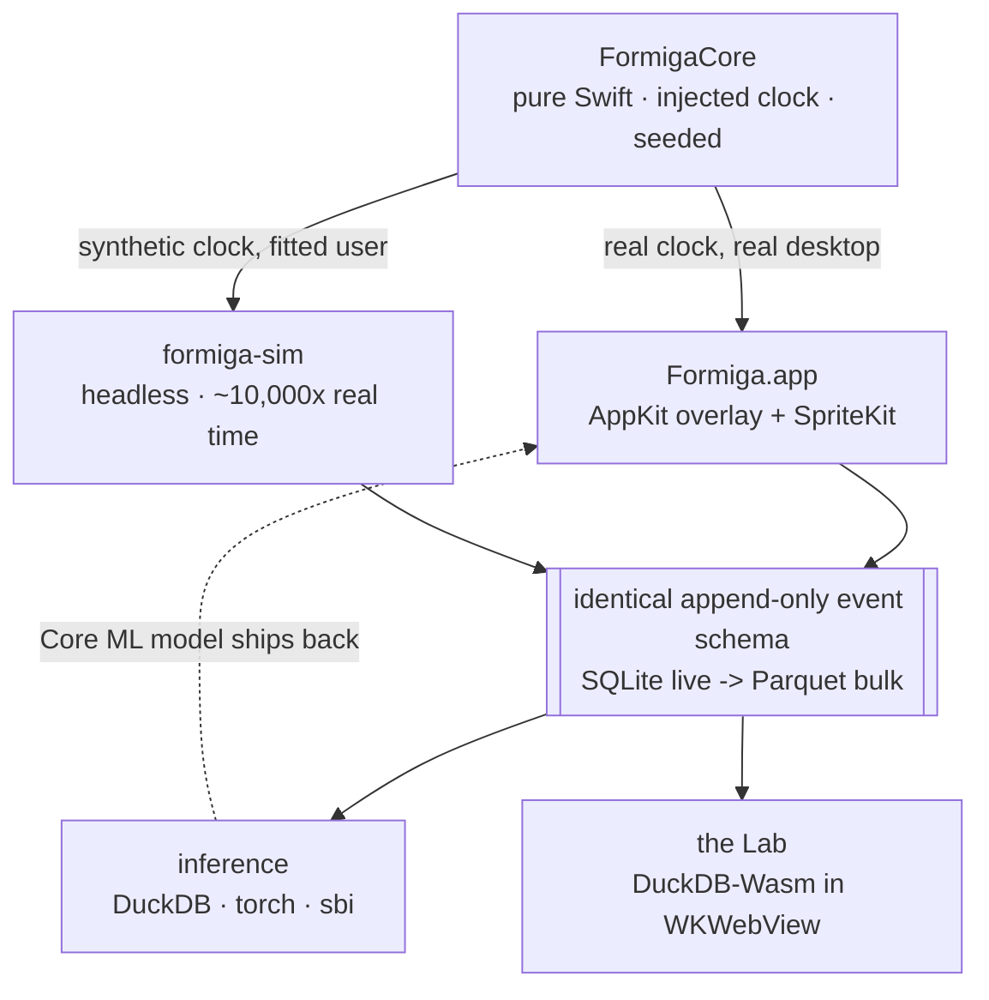

# Formiga — Build Plan v1

> A persistent colony of pixel-art creatures that live on the macOS desktop — walking window
> ledges, napping in the corner you never click, learning your hours. Underneath, every decision
> they make is logged into a longitudinal behavioural dataset. **And the parameters that generated
> them are sealed away from the analysis, so recovering those parameters is a real experiment with
> a real answer key.**

**Scope:** ~25 weeks · macOS first · MIT · no network, no telemetry, no TCC permissions.

---

## 1. Thesis

Most desktop-pet software fails in one of two directions: a toy with no substance, or substance
that leaks upward and turns a companion into a chore — meters, streaks, notifications, guilt.

Formiga's position is that the interesting engineering should be **completely invisible** from the
desktop. A creature naps in the corner because it is tired. That it is tired because a sealed
twelve-parameter genome interacts with a utility policy under a circadian forcing function is not
information the desktop layer is ever allowed to volunteer.

The payoff for that discipline is that the behaviour is genuinely generated rather than scripted,
which means it can be genuinely *studied*.

**The load-bearing idea:** each creature is born with hidden parameters. The analysis stack never
sees them. Recovering them from observed behaviour alone — and then checking — is a
parameter-recovery study with ground truth.

### What this deliberately is not

- No notifications, badges, streaks, or daily-login anything.
- No hunger, no death, no failure state. Neglect is a valid way to play.
- No currency, no shop, no unlocks gated behind attention.
- No cloud, no account, no telemetry. The dataset is the user's and stays on disk.
- No tutorial. The first creature just shows up and walks to a corner.

---

## 2. The sealed-latents firewall

The temptation, once you are logging everything anyway, is to log internal state next to behaviour
and let the Lab plot both. Do that and the experiment quietly dies: any feature you engineer is one
join away from the answer, and every result becomes unfalsifiable.

So the simulator writes **two streams to two separate stores**, and the analysis stack is wired to
only one of them.



The Lab has two modes. **Observer mode** is the default and shows only what an outside naturalist
could have seen. **Omniscient mode** overlays ground truth on every chart — indispensable for
debugging the simulation, fatal to the study if used carelessly. `unblind()` permanently marks that
creature as a burned specimen: you can still look, but the record shows you looked, and the creature
is excluded from headline results automatically.

A practical consequence worth stating up front: **you must be able to debug a creature without
unblinding it.** Observer mode has to be good enough to diagnose a broken policy from behaviour
alone. This is annoying, and it is exactly the skill the project is about.

---

## 3. Architecture — one core, two drivers

The single most important architectural decision: **the simulation must run faster than real time,
headless, with no desktop attached.** Without that, the ML half waits months for data and dies.
With it, you generate ten thousand creature-years overnight.



Because both drivers run identical core logic against the identical schema, a model trained on bulk
synthetic runs is valid on the live creatures — and can be exported to Core ML and run in-app.

| Layer | Choice | Reasoning |
|---|---|---|
| Overlay + shell | Swift / AppKit / SpriteKit | Every hard problem here is OS integration, and native solves all of them free: per-pixel `hitTest` so clicks pass through everything but the sprite, `collectionBehavior` for all-Spaces presence, GPU sprite batching at near-zero CPU, ~40 MB resident for something running 24/7. |
| Behaviour core | Swift package, no platform deps | Buys the headless runner, testability, Linux builds for bulk generation, and a future Windows port that reimplements only the shell. |
| Write path | SQLite + WAL (GRDB) | Tiny frequent transactions, crash-safe, zero operational surface. |
| Read path | DuckDB over Parquet | Columnar scans over a year of history. |
| Lab UI | Web app in a WKWebView | Exploratory dataviz is an order of magnitude cheaper in D3 / Observable Plot; DuckDB-Wasm queries Parquet with no server. |
| Inference | Python: Polars, PyTorch, `sbi` | Offline, batch, same Parquet, exports to Core ML. |

**Rejected alternatives.** Electron would be faster to a first demo and gives click-through with
forwarded mouse events almost free — rejected on resident memory (~300 MB for an always-on ambient
app is a reason people quit). Tauri has [no per-region hit-testing](https://github.com/tauri-apps/tauri/issues/13070),
so you hand-write a 60 Hz cursor-polling loop, and there are outstanding macOS transparency bugs
that appear only in release bundles.

---

## 4. The creature — genome, state, policy

Three tiers, strictly separated. The **genome** is fixed at birth. The **state** evolves
continuously. The **policy** is a fixed function shared by every creature — individuality comes
entirely from the genome weighting that function differently. That constraint matters for
inference: recovering a creature reduces cleanly to recovering its twelve numbers.

### Policy: utility selection, not a behaviour tree

```
every 500 ms, for each candidate behaviour a:

  U(a) = Σᵢ  w[a,i](θ) · fᵢ(x_t, e_t)      ← drive terms
       +   h(a, context) · θ.habit_rate     ← routine pull
       +   κ · 1[a = a_{t-1}]               ← commitment, kills flicker

  P(a) = softmax( U / θ.decision_temperature )

movement integrates at 10 Hz; decisions resample at 2 Hz
```

Chosen over a behaviour tree or FSM for three reasons: it produces smooth non-repetitive behaviour
without hand-authoring transitions; it stays hand-tunable when a creature does something stupid;
and it is a *generative model with known structure and unknown parameters*, which is precisely the
shape parameter recovery needs. RL was considered and rejected — a learned policy has no
ground-truth parameters to recover, which deletes the experiment.

### The genome — twelve sealed numbers

| Parameter | Effect | Status |
|---|---|---|
| `circadian_phase` | Clock hour of peak energy. Morning creature vs. night creature. | SEALED |
| `circadian_amplitude` | How hard the day/night swing hits. | SEALED |
| `metabolic_rate` | Energy drained per unit movement; sets rest frequency. | SEALED |
| `neophilia` | Pull toward unvisited regions and newly opened apps. | SEALED |
| `thigmotaxis` | Preference for edges and window borders over open desktop (wall-hugging). | SEALED |
| `sociability` | Signed attraction to other creatures. Negative produces loners. | SEALED |
| `startle_threshold` | Input-burst magnitude that triggers freeze, then flee. | SEALED |
| `habit_formation_rate` | How quickly a repeated choice hardens into routine. | SEALED |
| `attachment_gain` | How fast bonds form to places, apps, and the cursor. | SEALED |
| `decision_temperature` | Decisive vs. flighty. | SEALED |
| `trail_fidelity` | How strongly it follows others' pheromone. | SEALED |
| `deposition_rate` | How much trail it lays. | SEALED |
| `name`, `morphology_seed` | Cosmetic identity — palette, silhouette, antennae, gait. Generated from an **independent** seed, deliberately uncorrelated with the genome, otherwise a screenshot leaks the answer. | observable |

### Internal state — also sealed

Seven continuous variables plus two memory structures, updated every tick, written only to the
sealed store: `energy`, `boredom`, `comfort`, `social_need`, `curiosity_satiation`, `arousal`,
`warmth`, plus a `place_attachment` field over screen regions and a `habit_table` over
(context → behaviour) pairs. What reaches the Lab is where the creature was and what it did.

### The ethogram

A formal behaviour catalogue in the ethological sense — the shared vocabulary between the animation
layer, the event schema, and every model downstream. Adding a behaviour means adding a row here first.

| Behaviour | Reads on screen as | Driven by |
|---|---|---|
| `forage` | Wandering with short pauses and frequent reorientation | boredom, neophilia |
| `trail_follow` | Walking an established path with few deviations | trail gradient × trail_fidelity |
| `perch` | Sitting on a window's top edge, facing outward | thigmotaxis, comfort |
| `investigate` | Moving toward a window that just opened or came forward | neophilia, arousal |
| `observe_cursor` | Turning to track the pointer, briefly | arousal, attachment |
| `freeze` | Stopping flat, no animation, 1–6 s | input burst > startle_threshold |
| `flee` | Fast run to the nearest edge or under a window | arousal well above threshold |
| `groom` | Stationary idle loop | comfort high, boredom low |
| `rest` | Settled, slowed animation, gradual recovery | energy falling |
| `sleep` | Fully still, strong recovery | energy low × circadian trough |
| `approach` | Closing distance on another creature | social_need × sociability |
| `avoid` | Opening distance from another creature | negative sociability, low comfort |
| `accompany` | Matched movement alongside another creature | relationship strength |
| `home` | Direct return to a strongly attached location | place_attachment, routine |

---

## 5. Sensing — everything they know, and nothing they shouldn't

A creature that reacts to what you are doing needs to sense what you are doing. That is exactly
where an app like this usually asks for Accessibility and Input Monitoring, and exactly where most
people quit the installer.

Hard constraint: **Formiga requests no TCC permission at all.** Not Accessibility, not Input
Monitoring, not Screen Recording, not Full Disk Access.

| Signal | Source | Prompt |
|---|---|---|
| idle seconds | `CGEventSourceSecondsSinceLastEventType(.hidSystemState, .anyInputEventType)` at 1 Hz | none |
| activity density | Derived from the idle timer alone: fraction of the last 30 samples in which the counter reset. Distinguishes typing from reading from away **without ever seeing an event.** This is the trick that makes the whole privacy posture work. | none |
| frontmost app | `NSWorkspace.didActivateApplicationNotification` → bundle identifier | none |
| app category | Static bundle-ID → category map shipped in-app (writing, code, browser, media, comms, design, terminal, game). Unknown → `unknown`. No network call, ever. | none |
| window geometry | `CGWindowListCopyWindowInfo(.optionOnScreenOnly)` → `kCGWindowBounds`, `kCGWindowLayer`, owner PID. Polled at 2 Hz and on activation. | none |
| window titles | **Deliberately not read.** `kCGWindowName` is redacted without Screen Recording, and that is the correct default — a title is a document name, a URL, a subject line. | n/a |
| displays | `NSScreen.screens` + `didChangeScreenParametersNotification` | none |
| screen state | Lock, sleep, wake, Space-change notifications | none |

Never collected under any circumstance: keystrokes or key rates, clipboard, window titles, file
paths, URLs, screenshots, or anything over the network. There is no telemetry endpoint to disable
because there is no telemetry.

> **Verify in week one.** The App Sandbox may restrict `CGWindowListCopyWindowInfo`. If it does,
> the choice is direct notarised distribution instead of the Mac App Store — which is the
> recommendation anyway, but it needs to be a decision made with the answer in hand rather than a
> discovery in month five.

---

## 6. Colony — relationships and the trail field

The colony starts at one. A second creature arrives after roughly a week of accumulated runtime, a
third some time after, up to a cap of eight. Arrival is a function of elapsed time and ecosystem
stability, never of anything the user is asked to do.

**Relationships.** An *encounter* is logged when two creatures stay within a proximity threshold for
more than a few seconds. Its outcome — approach, mutual, avoid, ignore — falls out of both
creatures' sociability and current state, and nudges a signed pairwise affinity that decays slowly
toward zero. Because affinity is hidden state and encounters are observable, "can you reconstruct
the social graph from co-location alone?" is another clean sub-study with an answer key.

**The trail field.** Each display carries a coarse scalar grid (32 px cells) holding a pheromone
value with a ~20 minute half-life. Creatures deposit as they walk at `deposition_rate` and sense the
local gradient weighted by `trail_fidelity`. Highest value per line of code in the project, because
it pays off four times:

1. **Emergence** — paths appear across the desktop that nobody authored.
2. **Coordination without messaging** — creatures influence each other through the environment, which is both how real ants do it and vastly simpler to implement.
3. **Visualisation** — a week of accumulated trail is the most striking image the Lab can produce.
4. **Inference** — two more sealed parameters with a clean behavioural signature.

Trails render invisibly by default; optional faint reveal on the desktop, full visibility in the Lab.

---

## 7. Data platform

### Schema

```
observations.sqlite            -- crosses the firewall
  creature      id, name, morphology_seed, born_at, cohort
  sample        t, creature, display, x, y, behaviour, target_kind, target_id
  episode       creature, behaviour, t_start, t_end, display, centroid, path_len, ended_by
  event         t, creature, kind, payload
  encounter     t_start, t_end, a, b, min_distance, outcome
  context       t, app_category, activity_density, idle_s, n_windows, screen_state
  dormancy      t_start, t_end, reason
  trail_frame   t, display, grid_blob

latents.sqlite                 -- sealed, never joined in Observer mode
  genome        creature, <12 parameters>, prior_sample_id
  latent_state  t, creature, energy, boredom, comfort, social_need, arousal, ...
  utility_trace t, creature, utility_vector, chosen    -- 1% sample + eval windows
  unblinding    t, creature, actor, reason
```

`utility_trace` is the sleeper: it records what the policy actually scored at each decision, which
makes the exact conditional entropy of the true policy computable later — the most interesting
number in the project. At full rate it is 190 MB/day, so it is sampled at 1% plus full capture
during designated evaluation windows.

### Volume, honestly

| Stream | Rate | Rows/day | Bytes/day |
|---|---|---|---|
| `sample` | 1 Hz × 6 | 518,400 | 25 MB |
| `latent_state` | 1 Hz × 6 | 518,400 | 31 MB |
| `trail_frame` | 1/min | 1,440 | 6 MB |
| `context` | 1 Hz | 86,400 | 3 MB |
| `episode` | ~400/creature | 2,400 | 300 KB |
| `event` | discrete | ~1,500 | 200 KB |
| `utility_trace` | 1% of 2 Hz | 10,400 | 400 KB |

~65 MB/day raw = 24 GB/year, obviously unacceptable for a background app. The fix is that the
high-rate streams are the least semantically valuable ones.

| Tier | Window | Kept |
|---|---|---|
| hot | 7 days | Everything at full rate. ~450 MB. |
| warm | 90 days | 1-minute aggregates of `sample` and `context`. Episodes, events, encounters intact. |
| cold | forever | 5-minute rollups plus **full-fidelity** episodes, events, encounters, dormancy — the semantic record, ~500 KB/day. |

**Budget: under 500 MB after a year of continuous use.** A nightly compaction job does the rollups
and writes date-partitioned Parquet for the analysis path.

### Dormancy is data

Creatures do not simulate while the app is closed or the machine is asleep. No offline progression —
you never come back to a week having happened without you. The gap is written as an explicit
`dormancy` span, and every model treats those spans as censored intervals rather than continuous
time. Skipping this quietly poisons every duration estimate downstream with fake multi-hour bouts.

### Integrity invariants, as tests

1. Episodes tile each creature's timeline exactly — no overlaps, no gaps except dormancy spans.
2. Every dormancy span corresponds to a matching gap in every 1 Hz stream.
3. Same seed + same environment trace → byte-identical observation stream. Determinism is a regression test, not an aspiration.
4. Rollups agree with raw data within tolerance across the overlap window.
5. `observations.sqlite` contains no column derivable from the genome. A reviewer should be able to check this by reading one test.

---

## 8. The Lab

An optional window, never opened on your behalf, running a local web app over DuckDB-Wasm reading
the Parquet files directly — no server, no export step. Every view respects Observer mode by default.

| View | What it answers |
|---|---|
| **Ethogram raster** | The spine of the Lab and the canonical ethology plot: one row per creature, time along x, behaviour as coloured bands. Zooms from one hour to one year. |
| **Routine clock** | 24-hour polar plot of behaviour probability by hour, one ring per week — you watch routines crystallise from noise as the rings go outward. |
| **Occupancy field** | Where a creature actually lives, as a heatmap over screen coordinates with the typical window layout ghosted underneath. |
| **Trail atlas** | Accumulated pheromone over any chosen window. The routes the colony wore into your desktop. |
| **Social graph** | Force-directed, edges weighted by affinity *estimated from encounter data* — never the true affinity, which is sealed. |
| **Behaviour flow** | Transition matrix as a chord diagram. Which behaviours follow which, and how that changes with app category. |
| **Bout distributions** | Duration histograms per behaviour, log scale. Reveals whether resting is memoryless or heavy-tailed. |
| **Event feed** | Plain sentences. "14:02 — Vela startled at the left edge and hid under the terminal for four minutes." The one view a non-technical visitor enjoys. |
| **Anomaly timeline** | Days flagged by distance from the creature's own rolling behavioural baseline. |
| **Prediction Arena** | The evaluation harness, dressed as a game. See below. |

---

## 9. Inference — four studies with answer keys

Each has a stated method, a deliverable, and a metric that can come back negative. Run in order;
each one's failure mode informs the next.

### Study 1 — Trait recovery from summary statistics

~60 features per creature-day across four families: **spatial** (occupancy entropy, radius of
gyration, edge-proximity fraction, step-length and turning-angle distributions), **temporal**
(activity onset/offset, cosinor acrophase, per-behaviour bout statistics), **social** (encounter
rate, approach-to-avoid ratio, nearest-neighbour distances), **reactive** (latency to reorient after
an app switch, freeze rate following input bursts). Ridge, then gradient boosting, cross-validated
across creatures — never across time within a creature, which would leak.

> **Deliverable:** an *identifiability map* — R² per parameter plus the pairwise confounds. The
> expected and more interesting result is that some parameters are structurally unrecoverable;
> metabolic rate and circadian amplitude almost certainly trade off. **Proving a parameter cannot be
> recovered from behaviour is a better finding than a table of high scores.**

### Study 2 — Next-action prediction against a known entropy floor

Tokenise `(behaviour, context bucket, time bucket)`; train a GRU or small causal Transformer over
recent transitions. Baselines: marginal frequency, first-order Markov, context-conditional Markov.
The ceiling is the exact conditional entropy of the true policy, `H(a_t | x_t, e_t, θ)`, computable
from `utility_trace` because you own the simulator.

> **Deliverable:** the gap-closed metric — how far the model travels from the best baseline toward
> the irreducible floor. Applied ML essentially never knows the irreducible uncertainty of its own
> task; "0.44 nats against a 0.38 nat floor" is a categorically stronger claim than "72% accurate."

### Study 3 — Hidden-state recovery

Fit a hidden *semi*-Markov model over the observed behaviour sequence — semi-Markov because bout
durations carry real information and a plain HMM forces geometric dwell times it does not have.
Align discovered states to discretised true internal regimes by Hungarian assignment.

> **Deliverable:** adjusted mutual information between recovered and true state sequences, and the
> qualitative question underneath — does an unsupervised model independently rediscover *tired*,
> *bored*, and *content*?

### Study 4 — Simulation-based inference (capstone)

Use the headless simulator as the generative model directly. Sample θ from the prior, simulate a
month, compute summary statistics, train a neural posterior estimator with `sbi`. Yields a full
posterior over θ for real creatures rather than a point estimate. Validate with simulation-based
calibration: rank statistics uniform under the prior, and 50% / 90% credible intervals covering at
nominal rates.

> **Deliverable:** a calibration plot, honest coverage numbers, and only then the unblinding. If the
> intervals cover correctly, the entire architecture — sealed latents, headless generation, shared
> schema — is vindicated in one figure.

### Closing the loop

Export the Study 2 model to Core ML and run it inside the app, so the Lab can show a live
next-behaviour prediction beside the creature it is predicting.

### The Prediction Arena

The Lab shows you the last sixty seconds of a creature — its path, its behaviour, the context
around it — and asks you to pick what it does next. The model picks too. Then the truth. A running
scoreboard tracks **you**, **the model**, **a Markov baseline**, **chance**, and **the entropy floor**.

It is the evaluation harness and it is also the best feature in the product, because it is the
moment where somebody who came for a cute desktop bug discovers they have been studying an animal
for a month and have opinions about it.

---

## 10. Phases

Each phase ends in a demo, not a checklist. A phase that cannot produce one was scoped wrong.

| # | Phase | Weeks | Gate |
|---|---|---|---|
| 0 | **Platform spike** | 1 | *A pixel bug walks along the top of my editor window and I can still click the editor.* |
| 1 | **One creature alive** | 3 | *It naps when I stop typing, and a hundred simulated days finish in under a minute.* |
| 2 | **Personality** | 3 | *Two creatures born from the same code are visibly different animals.* |
| 3 | **Colony** | 3 | *After a week there is a visible worn path across my desktop that nobody designed.* |
| 4 | **Lab v1** | 3 | *I can describe a creature's personality using only the charts.* |
| 5 | **Data platform** | 2 | *A simulated year occupies under 500 MB and every invariant test passes.* |
| 6 | **Inference I** | 3 | *I can state which traits are recoverable and which are not, with numbers.* |
| 7 | **Inference II** | 4 | *A calibration plot with honest coverage, produced before unblinding.* |
| 8 | **Release** | 3 | *Someone installs it, forgets about it for a month, then opens the Lab.* |

**Phase 0** — Transparent, click-through, always-on-top overlay across every display and Space, one
hardcoded sprite. Idle time, frontmost app, window bounds. Zero permission prompts. Sandbox check.

**Phase 1** — `FormigaCore` as a standalone package: utility policy, 8 of 14 behaviours, injected
clock, `Environment` protocol with real and synthetic implementations. SQLite logging. The
`formiga-sim` headless runner with the determinism test green.

**Phase 2** — The twelve-parameter genome and the sealed-latents split, with the schema test
enforcing it. Habit formation, place attachment, procedural pixel morphology, naming.

**Phase 3** — 3–8 creatures. Encounters, affinity, the remaining 6 behaviours. The pheromone field.

**Phase 4** — WKWebView + DuckDB-Wasm over Parquet. Ethogram raster, routine clock, occupancy field,
trail atlas, social graph, event feed. Observer mode only — Omniscient mode is not built yet, on purpose.

**Phase 5** — Nightly compaction, three retention tiers, Parquet export, dormancy spans, the five
integrity invariants as tests, and a dataset card.

**Phase 6** — Studies 1 and 2. Omniscient mode and the unblinding ledger ship here, because now
there is something to score. Prediction Arena goes live.

**Phase 7** — Studies 3 and 4. Core ML export and live in-app prediction.

**Phase 8** — Signing, notarisation, energy audit against the CPU/memory budgets, the
onboarding-that-is-not-a-tutorial, and the write-up.

25 weeks at a serious hobby pace. **If time runs short, cut phase 7 before cutting phase 2** — a
charming ecosystem with one solid study beats a thin ecosystem with four.

---

## 11. Risks

| Risk | Severity | Mitigation |
|---|---|---|
| **Battery and CPU cost** — people uninstall battery drains without ever filing a bug | fatal | Hard budget from day one: <1% CPU, <40 MB resident at idle, measured in CI. Adaptive tick: 10 Hz while creatures move, 1 Hz while all rest, fully paused when the screen locks. Pause the SpriteKit scene rather than rendering still frames. |
| **Creatures cover your work** | fatal | Click-through everywhere except the sprite's own opaque pixels. Creatures avoid the frontmost window's centre and any active text-entry region. Global shoo hotkey. Per-app opt-out. |
| **Real-time collection too slow to train on** | fatal | The headless runner exists from phase 1, not phase 6. This is the entire reason the core is a platform-free package. |
| **Simulation settles into a boring equilibrium** | high | Nightly soak test runs 1,000 simulated days and asserts behavioural diversity metrics (action entropy, occupancy entropy, encounter rate, bout-length variance) stay in bounds. Boredom becomes a failing test. |
| **Synthetic environments don't resemble a real user** | high | Fit a semi-Markov model of app-category and idle behaviour to the real logged context stream; sample synthetic environments from it. Report the real-vs-synthetic performance gap rather than hiding it. |
| **Unblinding contaminates the studies** | high | The firewall plus the ledger, enforced in code and covered by a test. Burned specimens excluded from headline numbers automatically. |
| **Scope** | high | The phase gates. Each is a demo. A phase that can't produce one gets re-cut, not extended. |
| **Multi-display coordinate bugs** | medium | One canonical global coordinate space in the core; convert only at the window boundary. Hot-plug and resolution-change tests. |
| **Full-screen apps hide the overlay** | accepted | Don't fight the window server. Creatures "go underground" and the interval is logged as dormancy. Documented as behaviour, not papered over as a bug. |

---

## 12. Open decisions

| Decision | Recommendation |
|---|---|
| **Platform reach** — macOS only, or cross-platform now? | **macOS only.** The platform-free core preserves the option at almost no cost; a later Windows port reimplements the shell and nothing else. |
| **Ants, or generic creatures?** | **Lean into ants.** Ant behaviour is among the best-studied domains in ethology, so thigmotaxis, trail-following, and task allocation stop being invented mechanics and become things with literature behind them. The trail field alone justifies it. |
| **Distribution** — App Store or direct? | **Direct, notarised, free, MIT.** Verify the sandbox/`CGWindowList` question in phase 0 regardless, so it's a decision rather than a discovery. |
| **Colony growth** — grow, or user-set count? | **Grow.** Arrival is the only event in the product with any drama in it; spending it on a settings slider wastes the best moment the design has. |
| **Where the Lab lives** | **Embedded**, but built as a standalone web app that happens to be hosted in a WKWebView — so it also runs against an exported Parquet directory in a plain browser, which is what you'll want when writing this up. |

---

## 13. Week one, concretely

Phase 0 exists to answer platform questions that could invalidate everything after it. Nothing here
is creature work, deliberately.

1. An `NSWindow` subclass at `.statusBar` level: `isOpaque = false`, clear background,
   `collectionBehavior = [.canJoinAllSpaces, .stationary, .ignoresCycle]`, one instance per
   `NSScreen`, rebuilt on `didChangeScreenParametersNotification`.
2. A hosted `SKView` with one nearest-neighbour-filtered sprite walking a straight line. Confirm it
   survives a Space switch and a display hot-plug.
3. Per-pixel hit testing: override `hitTest` so the window swallows clicks only over non-transparent
   sprite pixels. Verify by clicking through it into a real app.
4. Sample `CGEventSourceSecondsSinceLastEventType` at 1 Hz, derive activity density from the last 30
   samples, print it. Watch the number while you type, while you read, and while you walk away.
5. Subscribe to `NSWorkspace.didActivateApplicationNotification`; log bundle identifiers only.
6. Call `CGWindowListCopyWindowInfo(.optionOnScreenOnly, kCGNullWindowID)` and confirm you get
   bounds and owner PIDs with **no permission dialog** and no titles.
7. Repeat step 6 inside a sandboxed build. This single result decides the distribution question.
8. Measure idle CPU and resident memory over an hour. Write the numbers down — they are the budget
   everything else is held against.

If all eight pass, the risky part of this project is behind you in week one and the remaining
twenty-four weeks are ordinary work.
