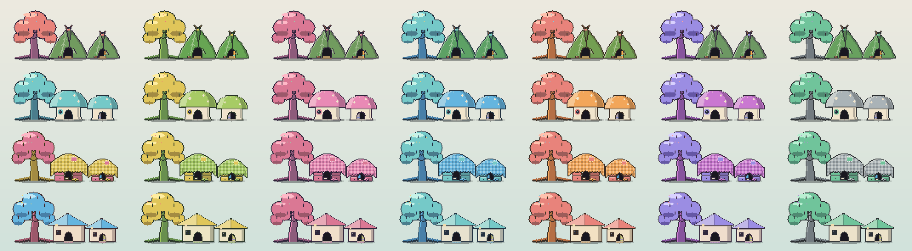

# Release notes

What each release brought, written for the people using Formiga. Each section is the "New in"
note the README carried while that release was current. [CHANGELOG.md](../CHANGELOG.md) is the
itemised record, with the fixes, compatibility notes, and measurements behind each one.

## New in 0.60.1

Choosing what a companion wears no longer jumps about under the pointer. Pointing at something
on a companion's profile put a line above the choices saying what was being tried on, and that
pushed every choice down out from under the pointer, so the line went away again, the choices
sprang back, and the menu shook faster than anything in it could be clicked. With the pointer high
on a choice, the one above slid under it instead, and a click put that on. The line is there all
the time now, with a word on what to do when nothing is being tried on, and a choice stays the same
size when it is pointed at, so nothing in the menu moves while you choose.

## New in 0.60.0

The village comes to life while the houses are out. Companions water the gardens, crouch to look
in on something just coming up, pick something ripe for a snack, and carry the best of it over to
show a friend. They see to their own houses the way each kind of house asks — retying a tent's
flap, plumping a pillow fort, patting a mushroom's cap, tidying a leaf house's leaves — and the
house answers. They go indoors now and then: the curtain is drawn across the door, the window
glows, and a Z drifts up if they are napping in there, but never so many at once that the village
looks empty. They climb up and sit on their own roofs. Gardens grow through sprouts and leaves to
flowers and fruit on their own, with no watering to keep up and nothing to wilt.

Little things go a little wrong, too. A leaf lands on somebody's face, a snack rolls away and has
to be chased, someone sits down just beside the cushion and shuffles across onto it — and whoever
is nearby stops to look. Yawns are catching: one companion yawns, the friend beside them looks
over and yawns a moment later, and every so often it reaches a third, who holds out for a second
before giving in.

There are a hundred and sixty keepsakes to find now, many of them only in the right moment — at
home, in the garden, on a roof, first thing in the morning, under a full moon. The Journal keeps
what has been found, and the Your colony page has the whole Collection, with the ones still to find
shown as shadows with a hint, and a choice of which sixteen hang in the trees. Finds become things
to wear: a leaf hat, a flower crown, a scarf, a tiny satchel, or any find at all as a pin, one each,
tried on in a few poses before it goes on.

The Home page is arranged right in its picture of the village: drag a cottage along the row, drag a
garden or a spot or an ornament along the ground, and click a house to choose its kind and what it
wears in each of its six places. Every category of village thing starts with three, and something
new arrives every day or two.

And companions spend about half of their roaming time up on the windows, where before a desktop of
ordinary windows had them all on the bottom row.

## New in 0.59.5

A companion with nothing to do now sits like it has something on its mind. Resting used to be a
one-pixel bob, held square to the screen for as long as nothing else was happening. Now a resting
companion settles, shifts its weight onto one foot, tips its head and pricks its ears toward
something off to one side, and settles back. Each one does it in its own way, leaning to its own
side, slumping into it or keeping its legs under it, so a colony sitting about is not a row of
companions doing the same nothing in step.

Companions say a little more, too. A game starts with a music note over each player's head, so a
pair breaking off from what they were doing reads as the start of something. A companion dropping
off to sleep shows a Z as it goes, whether that is by its own door, on the nap cushion, or out on
the desktop. And feet stay on the ground: a companion no longer rises a pixel or two as it sets
off walking and sinks back down when it stops.

A village that is out costs about half what it did. Whenever one resident was lively enough to
stroll a little faster than an old threshold allowed, strolling companions were drawn twenty times
a second instead of ten. Now every stroll is drawn at ten, and on the Mac Formiga is developed on,
a colony of five with its houses out went from 2.44% to 1.32% of one core.

Formiga also tidies up after its own updates. The installers it downloaded used to stay in its
data folder for good, one for every version it had ever been updated to. Now, each time Formiga
starts, it clears the ones for the version it is running and any earlier version.

## New in 0.59.2

A village of all kinds of house. There are four now, each built from a shape of its own: a tent
pitched from triangles of canvas, a mushroom of circles, a pillow house of two plump cushions, and
a leaf house roofed in rows of overlapping leaves. The colony house keeps the colony's own kind,
every cottage is built as the kind its keeper would build, and the Home page can build any house
as any kind.

The village is livelier while the houses are out. Companions stroll the ground between the trees
now — out from their own place, a look about, and back — slowly, a few at a time, where before
they mostly stood by their doors. And sleeping is sleeping: a companion on its way to bed walks
there, heavy-lidded, instead of being drawn asleep and gliding across the floor, and a sleeper that
has to make room is towed aside on a little rope by a friend.

## New in 0.59.0

Companions have more of the charm the very first ones had. New companions mix in classic parts —
candy colours, masks and visors, beads and tall eyes, stick legs on forked feet, antennae and
sprouts, stripes and spots, curled and starry tails — a part at a time, so one colony can hold the
tidy modular look, the older scrappier one, and everything between. Every companion you already
have looks exactly as it did. Each one also has little ways of its own now: a hop, a little dance,
or a twirl when something goes well, and before long a habit or two, like stretching before a nap
or looking a snack over before eating it.

The village has been rebuilt to match. Every house is made of its own materials and shaded like the
creatures, with its keeper's curtain in the doorway and a lamp in the window after seven in the
evening. From the Home page you can stand the cottages in any order, paint the village in one of
six named palettes, plant a flower bed, a vegetable patch, and a herb box, and put down a nap
cushion, a picnic blanket, and a lookout for the colony to use. While the houses are out, a
companion's menu offers a moment for the whole village — a picnic, a dance, or a nap — and whoever
wants to joins in.

You can send the colony as a postcard, too: everyone napping, picnicking, playing, or waving
goodnight in front of the village at dusk, with a caption of your own. The Journal opens on what
today was about, the Colony page shows how everyone gets along, favourite visitors can be invited
back from the Journal, and each companion can be given a leaning — homebody, floor-dweller, or
climber — that nudges where it likes to spend its time. The last change you make to the colony can
be undone from the footer of the settings window, a companion brought back exactly as it left.

A full colony of six gets everything a colony of four did, the colony follows where your Dock and
menu bar really are, a busy colony writes its file a few times a minute instead of every second or
so, and a companion that stops for a snack no longer glides across the desktop while it eats.

## New in 0.58.9

A colony that has filled up no longer leaves anybody standing on somebody else's face. Six
companions share the floor four used to, and the bookkeeping that watches for one of them being
drawn through another only had room for a colony of four — so once the sixth arrived it started
crediting one pair's time to a different pair entirely, and nobody was ever asked to step aside
from an overlap that was genuinely happening. The worst case measured twenty-two seconds of one
face behind another body. It is a little over two now, and across sixteen seeded sessions the
worst anywhere fell from 22.2 seconds to 8.2.

Two smaller things came out of the same work. A companion asked to step aside is now given the
time to actually do it before anybody checks again, instead of being assumed to have succeeded the
moment it was asked — which is what let a pair sit drawn through each other through a five-second
cooldown. And a companion walking over to a friend now keeps clear of whoever else is standing
about on the way, rather than aiming at a spot measured against its friend alone and landing on a
third.

## New in 0.58.8

Choosing where your companions live no longer leaves the desktop unusable. Opening the desktop
region editor used to freeze the colony on its last frame and draw none of the regions you dragged
out, and the first press on the desktop put a full-screen window in front of the settings panel —
so Apply and Cancel were both behind something that swallowed every click, and the only thing left
that answered the mouse was the tray icon. The editor now draws what you are drawing, and the
settings panel stays on top of it. Using the editor also used to cost you the creature menus for
the rest of the session: right-clicking a companion, petting one, and picking one up all stopped
working until Formiga was restarted. They come back now.

The village has also moved up off the Dock. The colony used to be founded forty points above the
bottom of the screen, which is inside a Dock at its factory size, so the houses spent their lives
behind it. They stand just clear of it now — and clear of the Windows taskbar, which gets the same
treatment.

## New in 0.58.7

A colony can grow to six now. Every full-size companion gets a house of its own, and the little
ones live with their big versions rather than in cottages of their own — so the corner is a row of
real houses rather than a row of doorsteps. It also takes up less of your desktop than the
four-companion village did, because the standing places between the houses are gone.

They are not standing places any more because the whole strip of ground between the two trees
belongs to the colony. A companion at home wanders it: somewhere to stand, a while there, then
somewhere else, keeping out of everybody's way and mostly out of the doorways. Hand it a snack
while it is walking and it stops where it is and takes it.

## New in 0.58.5

The colony corner has trees now — one at each end, with the houses gathered between them, so it
reads as one small place rather than a row of buildings. Every keepsake your creatures have found
hangs in the branches on a cord of its own: the everyday finds in the tree beside the colony
house, the ones that only turn up in a particular circumstance in the tree at the far end. Each
keepsake keeps its spot for good, so a tree fills in over the months exactly as the scrapbook
does. The colony's belongings have moved out of the lane between the houses and lie scattered
around the two trunks instead, a few behind each tree and a few out in front of its roots.

A visitor arriving at the houses walks the village now instead of standing at one end of it. It
goes from place to place, stopping a few times, and at each stop it goes over to whichever
companion it has not met yet — so a visit means meeting everybody rather than keeping one
creature company. Companions near one another have also stopped shivering on the spot: a walk
now stops when it arrives somewhere rather than stepping over the spot and back.

For all that, the village takes up less of your desktop than it did — about 15% narrower, with
two trees in it that were not there before. Formiga also does less work to keep the colony
going: on a busy desktop with the cursor moving it costs roughly a quarter less than it used to,
and a colony at home about three fifths less, with not a single creature behaving differently.

Nothing about your colony needs doing. The save file is unchanged, so 0.58.5 opens what 0.58.0
wrote and the trees simply appear, drawn from the seed and the scrapbook your colony already has.

## New in 0.58.0

Right-click a creature — Control-click on macOS — and a small strip floats above its head: hold out
a snack, hold out a toy, send the whole colony home, or open that creature's profile. Whether the
snack or the toy is taken is up to the creature. A hungry one eats, a bored one plays, a sleepy one
shows you it would rather not, and a timid one takes a moment to think it over. Creatures answer
what you do with a small picture above the head rather than with words: a heart for a pet, a dizzy
swirl after a toss lands, a house when they are on their way home. They have also stopped standing on
top of one another — a face hidden behind somebody else's body is cleared within a moment, though
friends still rest shoulder to shoulder, because that is how creatures rest.

Someone new turns up at about one home gathering in four: a creature from nowhere in particular who
walks in along the floor, says hello, spends the gathering pottering about with your colony, and
leaves before the houses close. You can also paste a friend's seed code to invite their creature for
a day, and if your colony has room you can ask a visitor to stay for good. The Journal page keeps a
guest book of the last two dozen who came by, each with a code to copy. The corner they visit has
grown, too: bigger cottages, every creature resting beside its own front door, and small doorstep
moments while the colony is home — a nibble, a nap, a wave the neighbour waves back at, a short
errand out to a belonging and back.

There are sixteen kinds of trinket to find now. Eight turn up on any ordinary day; the other eight
only ever turn up in a particular circumstance — after dark, high on a ledge, in the middle of a
window ride, or standing beside a close friend — and the scrapbook shows the ones nobody has found
yet as a dim silhouette with a hint. Any creature can be saved as an animated sticker, and the whole
colony as a portrait.

## New in 0.57.1

Your creatures now hold themselves the way the moment calls for. A watcher covers its eyes when the
jump looks bad, gasps at a near miss, and throws its arms up when it goes well. A jumper squares up
at the edge and wobbles when it just makes it. Tug of war is a real contest of shoulders, the
hide-and-seek seeker covers its eyes while counting, and the loser of a staring match hides its
face while the winners celebrate. Wings and paws also behave: whichever limb a creature has is the
one that reaches, instead of a second arm appearing beside it.

## New in 0.57.0

Your creatures notice the desktop, and each other. When a window moves, a companion riding it grips
on or enjoys the ride, and whoever is nearby turns to watch: a gasp at a close call, covered eyes
from a timid onlooker, delight when a landing goes well. A long jump brings a look down, a step
back, and sometimes a change of heart. Ordinary moments grow into small games — a chase, leapfrog,
tag, a race across your windows, the floor is lava, hide and seek, and more — and any creature can
decline to play.

The journal groups moments by day, filters to one companion, and keeps up to eight you want to hold
on to. A scrapbook remembers the first time each kind of trinket was found, and the home page shows
your actual village. Settings add a charcoal theme, larger text, an optional outline for busy
wallpaper, and a weekly routine that switches between your Work and Relax presets. Formiga also uses
a small fraction of the CPU it used to, and less memory.

## New in 0.55.6

Winged creatures grow real wings instead of large accent nubs. Every wing has a lit leading edge, a
shaded underside, and a tip carried up past the shoulder, and each creature grows one of three
structures over that: feathered quills, ribs reaching a drawn-down tip, or a pale panel behind a
darker rim. Which one a creature has comes from its own recipe, so it never changes and travels
with a shared seed code.

## New in 0.55.5

The blob returns as a body plan of its own. Alongside the round, upright, four-pawed, and winged
plans, a blob is a single soft mass that carries its face directly, with stubby feet and no separate
head. It mixes with the same ears, tails, markings, and colors as every other plan.

The colony corner is now a small village. The colony house keeps its own spot, and every companion
after the first gets a house of its own beside it — a full-size cottage for an adult, a matching
half-size one for a mini, all in the house's own style and palette. Loose objects have left their
cubbies and rest directly on the same ground line, tucked between the houses.

Decorations the home earns over time now attach to the shelter they belong to: banners hang from the
actual roofline, lamps mount on the wall, ornaments sit on the real peak, and stones and flowers rest
on the ground. Only the ground pieces still drift, and only by a pixel.

Every house is built from a shape of its own — a tent of canvas triangles, a mushroom of circles, a
house of plump pillows, a cottage roofed in leaves — shaded as the creatures are, with a sign that
somebody lives there, and a village mixes them. Each companion's door is hung with a curtain in its
own colours, and after dark the houses glow from inside.

The village is yours to arrange from the Home page. Stand the cottages in whatever order you like —
each curtain goes with its house, and everyone walks home to where theirs now stands — build any
house as a tent, a mushroom, a pillow house, or a leaf house, paint the village in Meadow,
Blossom, Harbour, Autumn, Twilight, or Pebble instead of its own colours, and plant a flower bed, a
vegetable patch, and a herb box along the ground. The colony house always stands first, and one
button puts the order, the kinds, the colours, and the gardens back as the village grew.

Toys, snacks, cups, and found trinkets are colored against the creature holding them instead of from
its coat, so a belonging reads as a separate thing rather than another marking.
